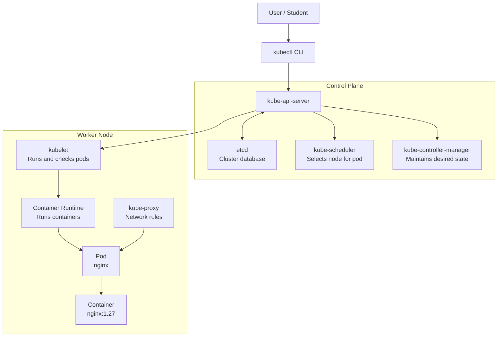

# Kubernetes Zero To Hero

Author style: Bari Sagar student notes

This repository is for learning Kubernetes from scratch with both theory and practical.

Learning method:

```text
Theory ---> Simple meaning ---> Real-time example ---> Diagram ---> YAML ---> Commands ---> Debugging ---> Interview points
```

Important:
Kubernetes is not only a Docker platform. Kubernetes is a container orchestration platform.
It is used to deploy, expose, scale, update, and self-heal containerized applications.

---

# Day 1 - Kubernetes Basics, Architecture, Setup, Namespace, Pod

## Day 1 Goal

By the end of Day 1, students should understand:

1. What Kubernetes is
2. Why Kubernetes is used
3. Kubernetes architecture
4. Control plane components
5. Worker node components
6. What `kubectl` is
7. What namespace is
8. What pod is
9. How to create first pod
10. How to check, describe, log, and delete pod

---

## 1. What Is Kubernetes?

Kubernetes is a container orchestration platform.

Simple meaning:

```text
Kubernetes is a manager for containers.
```

It helps us manage containerized applications in a cluster.

Kubernetes is used to:

- deploy applications
- expose applications to users
- scale applications up or down
- restart failed containers automatically
- update applications without downtime
- manage configuration and secrets
- manage networking between applications
- manage storage for applications

Real-time example:

Suppose we have an online shopping application.

It has:

- frontend app
- payment app
- order app
- user app
- database

If the payment app container goes down, Kubernetes can create a new one.
If more users come to the website, Kubernetes can increase the number of application pods.

Simple flow:

```text
Shopping application ---> Docker image ---> Pod ---> Kubernetes cluster ---> Users
```

---

## 2. Why Do We Need Kubernetes?

Before Kubernetes, teams manually managed servers and containers.

Problems without Kubernetes:

- manual deployment
- manual restart if container fails
- difficult scaling
- difficult load balancing
- difficult service discovery
- difficult rollback
- difficult configuration management

Kubernetes solves these problems.

Example:

If we want 3 copies of nginx application, we tell Kubernetes:

```text
replicas = 3
```

Kubernetes will make sure 3 pods are always running.

If one pod is deleted:

```text
Current state: 2 pods
Desired state: 3 pods
Kubernetes action: create 1 new pod
```

---

## 3. Kubernetes Basic Object Flow

```text
Cluster ---> Node ---> Pod ---> Container ---> Image
```

Explanation:

- Cluster is the full Kubernetes environment
- Node is a machine inside the cluster
- Pod is the smallest deployable unit
- Container runs inside the pod
- Image is used to create the container

Example:

```text
k8s-hero cluster ---> worker node ---> nginx pod ---> nginx container ---> nginx:1.27 image
```

---

## 4. Kubernetes Architecture Diagram



Diagram explanation:

1. Student runs `kubectl` command.
2. `kubectl` sends request to `kube-api-server`.
3. `kube-api-server` stores cluster data in `etcd`.
4. `kube-scheduler` decides which node should run the pod.
5. `kube-controller-manager` keeps desired state and actual state equal.
6. `kubelet` on worker node creates and monitors pods.
7. Container runtime runs the actual container.
8. `kube-proxy` helps with networking.

---

## 5. Desired State And Actual State

Kubernetes works using desired state.

Simple meaning:
We tell Kubernetes what we want. Kubernetes tries to make it real.

Example:

```text
Desired state: nginx pod should be running
Actual state: nginx pod is not running
Kubernetes action: create nginx pod
```

Another example:

```text
Desired state: 3 pods
Actual state: 2 pods
Kubernetes action: create 1 new pod
```

This is one of the most important Kubernetes concepts.

---

## 6. Control Plane

Control plane manages the Kubernetes cluster.

Simple meaning:
Control plane is the brain of Kubernetes.

Control plane makes global decisions for the cluster.

Examples:

- scheduling pods
- detecting node failures
- responding to cluster events
- maintaining desired state
- storing cluster information

Control plane components:

1. kube-api-server
2. etcd
3. kube-scheduler
4. kube-controller-manager

---

## 7. kube-api-server

kube-api-server exposes the Kubernetes API.

Simple meaning:
All Kubernetes requests go through kube-api-server.

Example command:

```powershell
kubectl get pods
```

What happens:

```text
kubectl ---> kube-api-server ---> cluster information
```

kube-api-server is responsible for:

- receiving requests
- validating requests
- communicating with etcd
- allowing other components to communicate

Interview point:
`kube-api-server` is the front door of the Kubernetes control plane.

---

## 8. etcd

etcd is a key-value database used by Kubernetes.

Simple meaning:
etcd is the database of Kubernetes.

It stores:

- node details
- pod details
- deployment details
- service details
- namespace details
- cluster state

Example:

If we create a pod, pod information is stored in etcd.

Interview point:
If etcd data is lost and no backup is available, cluster state can be lost.

---

## 9. kube-scheduler

kube-scheduler selects the node where a pod should run.

Simple meaning:
Scheduler decides the best worker node for a pod.

Scheduler checks:

- CPU availability
- memory availability
- node health
- taints and tolerations
- affinity rules

Example:

```text
New pod created
node1 has enough CPU and memory
scheduler assigns pod to node1
```

Interview point:
Scheduler does not run the container. It only selects the node.

---

## 10. kube-controller-manager

kube-controller-manager runs controller processes.

Simple meaning:
Controller manager continuously checks whether actual state matches desired state.

Example:

```text
Deployment desired replicas: 3
Currently running pods: 2
Controller manager creates 1 more pod
```

Common controllers:

- Node controller
- Job controller
- ReplicaSet controller
- Deployment controller
- EndpointSlice controller

Interview point:
Controllers are reconciliation loops. They watch current state and move it toward desired state.

---

## 11. Worker Node

Worker node runs application workloads.

Simple meaning:
Worker node is where application pods run.

Worker node components:

1. kubelet
2. kube-proxy
3. container runtime
4. pods

---

## 12. kubelet

kubelet runs on every node.

Simple meaning:
kubelet is the node agent.

kubelet is responsible for:

- receiving pod instructions
- asking container runtime to start containers
- checking pod health
- reporting node and pod status to API server

Example:

```text
kube-api-server tells kubelet to run nginx pod
kubelet asks container runtime to start nginx container
```

Interview point:
kubelet makes sure containers described in PodSpec are running and healthy.

---

## 13. kube-proxy

kube-proxy runs on every node.

Simple meaning:
kube-proxy maintains network rules for Kubernetes services.

It helps:

- pod-to-service communication
- service load balancing
- network routing rules

Example:

```text
frontend pod ---> backend service ---> backend pod
```

kube-proxy helps traffic reach the correct backend pod.

---

## 14. Container Runtime

Container runtime is software that runs containers.

Simple meaning:
Container runtime actually starts and stops containers.

Examples:

- containerd
- CRI-O
- Docker Engine older workflow

Flow:

```text
kubelet ---> container runtime ---> container
```

---

## 15. Pod

Pod is the smallest deployable unit in Kubernetes.

Simple meaning:
Pod is a wrapper around one or more containers.

Most common case:

```text
1 Pod ---> 1 Container
```

Possible case:

```text
1 Pod ---> 2 or more tightly connected containers
```

Pod has:

- its own IP address
- its own network namespace
- one or more containers
- temporary storage
- optional volumes

Example:

```text
nginx-pod ---> nginx container ---> nginx:1.27 image
```

Important:
We usually do not create standalone pods in production.
In production, we normally create Deployments, which manage pods.

---

## 16. Namespace

Namespace is used to group Kubernetes resources.

Simple meaning:
Namespace is like a separate room inside one cluster.

Example:

```text
dev namespace
test namespace
prod namespace
```

Why namespace is used:

- separate environments
- organize resources
- apply permissions
- avoid name conflicts

Example:

We can have:

```text
dev/nginx
prod/nginx
```

Both names are `nginx`, but they are in different namespaces.

---

## 17. kubectl

kubectl is the command line tool used to communicate with Kubernetes cluster.

Simple meaning:
kubectl is the remote control for Kubernetes.

Examples:

```powershell
kubectl get nodes
kubectl get pods
kubectl apply -f pod.yaml
kubectl delete pod nginx
```

Command flow:

```text
Student ---> kubectl command ---> kube-api-server ---> Kubernetes cluster
```

---

## 18. Day 1 Prerequisites

Required tools:

- Docker Desktop
- kubectl
- minikube
- PowerShell

Check tools:

```powershell
docker version
kubectl version --client
minikube version
```

Expected:

- Docker should show client and server version
- kubectl should show client version
- minikube should show version

If Docker server is not showing, start Docker Desktop.

---

## 19. Create Local Kubernetes Cluster

We use `minikube` for local Kubernetes cluster.

Minikube creates a local Kubernetes cluster for learning and practice.

Create cluster:

```powershell
minikube start --driver=docker
```

Check cluster:

```powershell
kubectl cluster-info
kubectl get nodes
kubectl get pods -A
```

Command meaning:

```text
kubectl cluster-info   ---> shows cluster endpoint
kubectl get nodes      ---> lists nodes
kubectl get pods -A    ---> lists pods from all namespaces
```

Expected node:

```text
minikube
```

In Minikube, one local node can act as the control plane and also run workloads for learning.

---

## 20. Namespace Commands

List namespaces:

```powershell
kubectl get namespaces
kubectl get ns
```

Create namespace:

```powershell
kubectl create namespace day1
```

Set current namespace:

```powershell
kubectl config set-context --current --namespace=day1
```

Check current namespace:

```powershell
kubectl config view --minify
```

Delete namespace:

```powershell
kubectl delete namespace day1
```

---

## 21. Create First Pod Using Command

Create nginx pod:

```powershell
kubectl run nginx --image=nginx:1.27 --port=80 -n day1
```

Check pod:

```powershell
kubectl get pods -n day1
```

Check pod with IP and node details:

```powershell
kubectl get pods -n day1 -o wide
```

Describe pod:

```powershell
kubectl describe pod nginx -n day1
```

Check logs:

```powershell
kubectl logs nginx -n day1
```

Enter inside pod:

```powershell
kubectl exec -it nginx -n day1 -- sh
```

Delete pod:

```powershell
kubectl delete pod nginx -n day1
```

---

## 22. Create First Pod Using YAML

File:

[day1/nginx-pod.yaml](<C:/bari_sagar/Kubernetes/day1/nginx-pod.yaml>)

YAML:

```yaml
apiVersion: v1
kind: Pod
metadata:
  name: nginx-pod
  namespace: day1
  labels:
    app: nginx
    class: day1
spec:
  containers:
    - name: nginx
      image: nginx:1.27
      ports:
        - containerPort: 80
```

Apply YAML:

```powershell
kubectl apply -f day1/nginx-pod.yaml
```

Check:

```powershell
kubectl get pods -n day1
kubectl get pods -n day1 -o wide
kubectl describe pod nginx-pod -n day1
kubectl logs nginx-pod -n day1
```

Delete:

```powershell
kubectl delete -f day1/nginx-pod.yaml
```

---

## 23. YAML Explanation

```yaml
apiVersion: v1
```

This defines the Kubernetes API version.

```yaml
kind: Pod
```

This tells Kubernetes we want to create a Pod.

```yaml
metadata:
  name: nginx-pod
  namespace: day1
```

This defines object name and namespace.

```yaml
labels:
  app: nginx
```

Labels are tags used to identify and select objects.

```yaml
spec:
```

This defines the desired configuration.

```yaml
containers:
  - name: nginx
    image: nginx:1.27
```

This defines container name and image.

```yaml
ports:
  - containerPort: 80
```

This documents that the container listens on port 80.

---

## 24. Day 1 Full Practical

Run these commands step by step:

```powershell
minikube start --driver=docker
kubectl cluster-info
kubectl get nodes
kubectl get pods -A
kubectl create namespace day1
kubectl run nginx --image=nginx:1.27 --port=80 -n day1
kubectl get pods -n day1
kubectl get pods -n day1 -o wide
kubectl describe pod nginx -n day1
kubectl logs nginx -n day1
kubectl delete pod nginx -n day1
kubectl apply -f day1/nginx-pod.yaml
kubectl get pods -n day1
kubectl describe pod nginx-pod -n day1
kubectl delete -f day1/nginx-pod.yaml
kubectl delete namespace day1
```

---

## 25. Common Day 1 Errors

### Error: Docker is not running

Reason:
Docker Desktop is not started.

Fix:
Start Docker Desktop and run:

```powershell
docker version
```

### Error: minikube command not found

Reason:
minikube is not installed or not added to PATH.

Fix:
Install minikube and reopen PowerShell.

### Error: kubectl command not found

Reason:
kubectl is not installed or not added to PATH.

Fix:
Install kubectl and reopen PowerShell.

### Error: ImagePullBackOff

Reason:
Kubernetes cannot pull container image.

Possible causes:

- wrong image name
- internet issue
- registry issue

Check:

```powershell
kubectl describe pod <pod-name> -n <namespace>
```

---

## 26. Day 1 Student Task

Task:

1. Create namespace `student-day1`
2. Create nginx pod inside that namespace
3. Check pod status
4. Check pod IP
5. Describe pod
6. Check logs
7. Delete pod
8. Delete namespace

Commands:

```powershell
kubectl create namespace student-day1
kubectl run nginx --image=nginx:1.27 --port=80 -n student-day1
kubectl get pods -n student-day1
kubectl get pods -n student-day1 -o wide
kubectl describe pod nginx -n student-day1
kubectl logs nginx -n student-day1
kubectl delete pod nginx -n student-day1
kubectl delete namespace student-day1
```

Student explanation to write:

```text
Today I created my first Kubernetes namespace and pod.
I learned that namespace is used to group resources.
I learned that pod is the smallest deployable unit in Kubernetes.
I used kubectl to create, check, describe, log, and delete pod.
```

---

## 27. Day 1 Interview Questions And Answers

### 1. What is Kubernetes?

Kubernetes is a container orchestration platform used to deploy, scale, expose, and manage containerized applications.

### 2. What is a cluster?

A cluster is a group of nodes where Kubernetes runs.

### 3. What is a node?

A node is a machine inside a Kubernetes cluster.

### 4. What is a pod?

A pod is the smallest deployable unit in Kubernetes. It runs one or more containers.

### 5. What is kube-api-server?

kube-api-server is the front door of Kubernetes. All requests go through it.

### 6. What is etcd?

etcd is the key-value database that stores Kubernetes cluster state.

### 7. What is kube-scheduler?

kube-scheduler selects the best node for newly created pods.

### 8. What is kubelet?

kubelet is the agent on every node that makes sure pods and containers are running properly.

### 9. What is kube-proxy?

kube-proxy maintains network rules on nodes and helps service communication.

### 10. What is kubectl?

kubectl is the command line tool used to communicate with Kubernetes cluster.

### 11. What is namespace?

Namespace is used to logically group Kubernetes resources inside a cluster.

### 12. Why do we use YAML in Kubernetes?

YAML is used to define Kubernetes objects in a declarative way.

---

## 28. Day 1 Revision

Remember this:

```text
Kubernetes = container orchestration platform
Cluster = group of nodes
Node = machine
Pod = smallest deployable unit
Container = app runtime
Image = app package
kubectl = CLI for Kubernetes
Namespace = resource grouping
```

Most important flow:

```text
kubectl ---> kube-api-server ---> scheduler/controller ---> kubelet ---> container runtime ---> pod
```

Day 1 completion checklist:

- [x] Docker is running
- [x] kubectl is installed
- [x] minikube is installed
- [x] cluster is created
- [x] node is visible
- [x] namespace is created
- [x] pod is created
- [x] pod is described
- [x] pod logs are checked
- [ ] pod is deleted
- [ ] namespace is deleted
---

## 29. Day 1 Lab Output On Local Machine

Date:

```text
July 6, 2026
```

Tool status:

```text
Docker CLI: Docker version 29.5.2
kubectl client: v1.34.1
minikube: v1.36.0
```

Cluster status:

```text
Context: minikube
Node: minikube
Node status: Ready
Kubernetes version: v1.33.1
```

Namespace created:

```text
day1
```

Pod created from:

```text
day1/nginx-pod.yaml
```

Pod output:

```text
NAME        READY   STATUS    RESTARTS   IP           NODE
nginx-pod   1/1     Running   0          10.244.0.4   minikube
```

Important observation:

```text
First status: ContainerCreating
Reason: Kubernetes was pulling nginx:1.27 image
Final status: Running
```

Container check:

```text
nginx version: nginx/1.27.5
```

Student note:

```text
Today we started Minikube, created namespace day1, deployed nginx pod using YAML,
checked pod status, described the pod, checked logs, and executed a command inside the container.
```

