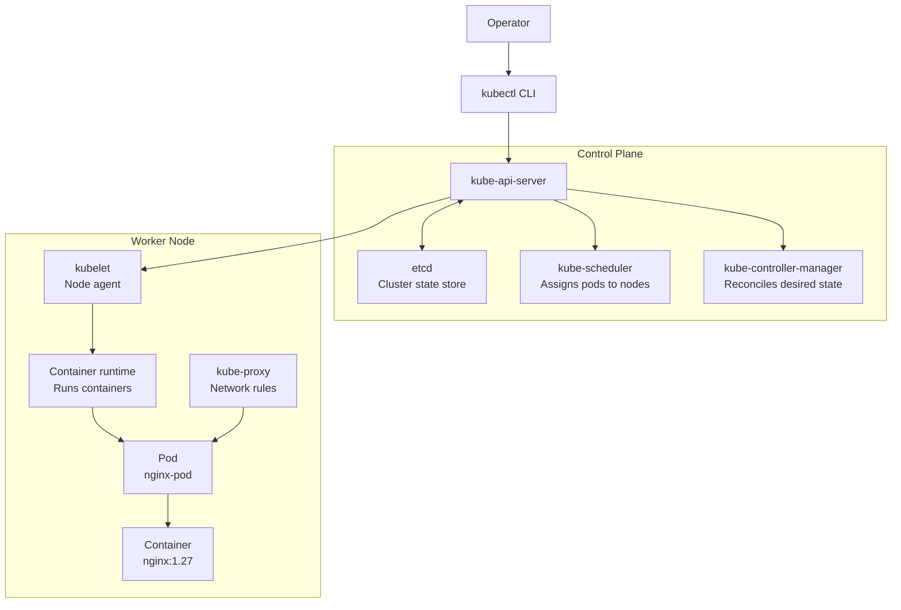

# Day 1 - Kubernetes Basics, Architecture, Setup, Namespace, And Pod

## Goal

Day 1 establishes the Kubernetes foundation. The focus is to understand how Kubernetes is organized, how the control plane works, how worker nodes run applications, and how to deploy the first pod using a YAML manifest.

By the end of this module, you should be able to:

- Explain what Kubernetes is and why it is used.
- Describe the Kubernetes control plane and worker node components.
- Start a local Kubernetes cluster with Minikube.
- Use `kubectl` to inspect cluster resources.
- Create a namespace for lab isolation.
- Deploy an nginx pod using a YAML manifest.
- Inspect, debug, and clean up the pod.

## What Kubernetes Does

Kubernetes is a container orchestration platform. It manages containerized applications across a cluster of machines.

Kubernetes helps with:

- Deployment: run application containers consistently.
- Scaling: increase or decrease application replicas.
- Self-healing: restart or replace failed containers.
- Service discovery: allow applications to find each other.
- Load balancing: distribute traffic across healthy pods.
- Configuration management: separate application configuration from images.
- Rollouts and rollbacks: update applications safely.

Example scenario:

```text
A web application runs in three pods.
One pod fails.
Kubernetes notices the failure and starts a replacement pod.
The application continues serving traffic through the remaining healthy pods.
```

## Core Object Flow

```text
Cluster ---> Node ---> Pod ---> Container ---> Image
```

Meaning:

- Cluster: the full Kubernetes environment.
- Node: a machine that participates in the cluster.
- Pod: the smallest deployable unit in Kubernetes.
- Container: the running application process.
- Image: the packaged application used to start a container.

Day 1 example:

```text
minikube cluster ---> minikube node ---> nginx-pod ---> nginx container ---> nginx:1.27 image
```

## Kubernetes Architecture



## Control Plane Components

### kube-api-server

`kube-api-server` is the front door of Kubernetes. Every `kubectl` request goes through it.

Example:

```powershell
kubectl get pods
```

Request flow:

```text
kubectl ---> kube-api-server ---> Kubernetes cluster state
```

Key responsibilities:

- Receive Kubernetes API requests.
- Validate requests.
- Read and update cluster state.
- Coordinate communication between Kubernetes components.

### etcd

`etcd` is the key-value database used by Kubernetes to store cluster state.

It stores information such as:

- namespaces
- pods
- deployments
- services
- nodes
- configuration state

Operational note:

```text
etcd is critical. In production, etcd must be backed up because it stores the cluster state.
```

### kube-scheduler

`kube-scheduler` decides which node should run a newly created pod.

It considers factors such as:

- available CPU and memory
- node health
- scheduling constraints
- taints and tolerations
- affinity and anti-affinity rules

Important distinction:

```text
The scheduler chooses the node. It does not start the container.
The kubelet and container runtime start the container.
```

### kube-controller-manager

`kube-controller-manager` runs controller processes that continuously compare desired state and actual state.

Example:

```text
Desired state: 3 replicas
Actual state: 2 running pods
Controller action: create 1 replacement pod
```

This reconciliation loop is one of the most important Kubernetes concepts.

## Worker Node Components

### kubelet

`kubelet` is the node agent that runs on each node.

It is responsible for:

- receiving pod instructions from the API server
- asking the container runtime to start containers
- monitoring pod and container health
- reporting status back to the API server

### kube-proxy

`kube-proxy` maintains network rules on each node.

It supports service networking, allowing traffic to reach the correct pods behind a Service.

### Container Runtime

The container runtime starts and manages containers.

Common runtimes:

- containerd
- CRI-O
- Docker Engine in older workflows

Flow:

```text
kubelet ---> container runtime ---> container
```

## Namespace

A namespace is a logical boundary used to organize Kubernetes resources.

Common examples:

```text
dev namespace
test namespace
prod namespace
```

Why namespaces are useful:

- separate environments
- group related resources
- reduce naming conflicts
- apply access controls
- manage quotas

Day 1 namespace:

```text
day1
```

## Pod

A pod is the smallest deployable unit in Kubernetes.

Most common pattern:

```text
1 pod ---> 1 container
```

A pod provides:

- a unique IP address
- a shared network namespace for containers inside the pod
- access to mounted volumes
- the runtime boundary for application containers

Production note:

```text
Standalone pods are useful for learning and debugging.
In production, workloads are usually managed by Deployments, StatefulSets, Jobs, or DaemonSets.
```

## Prerequisites

For local practice, use Minikube. Minikube runs a single-node Kubernetes cluster on your laptop or lab machine.

Minimum requirements:

- 2 CPUs or more
- 2 GB RAM minimum
- 20 GB free disk space
- Internet access
- Docker installed and running
- kubectl installed
- Minikube installed

Teaching point:

```text
Docker runs containers on one machine.
Kubernetes manages containers across a cluster.
Minikube gives us a local Kubernetes cluster for practice without cloud cost.
```

AWS analogy:

| Kubernetes | AWS ECS / Fargate Analogy |
| --- | --- |
| Cluster | ECS cluster or EKS cluster |
| Node | EC2 instance or worker machine |
| Pod | ECS task |
| Container | Container inside ECS task |
| Service | ECS service or service discovery |
| kubectl | AWS CLI for Kubernetes |

## Install Docker Desktop On Windows

1. Download Docker Desktop from the official Docker website.
2. Install Docker Desktop.
3. Start Docker Desktop.
4. Make sure Docker is using the Linux container engine.
5. Reopen PowerShell after installation.

Verify Docker:

```powershell
docker --version
docker version
docker ps
```

Expected result:

```text
Docker should show client and server information.
docker ps should run without a connection error.
```

If Docker is not running, start Docker Desktop and retry.

## Install kubectl On Windows

Option 1: Install with winget:

```powershell
winget install -e --id Kubernetes.kubectl
```

Option 2: Install with Chocolatey:

```powershell
choco install kubernetes-cli
```

Verify kubectl:

```powershell
kubectl version --client
```

Expected result:

```text
kubectl should print the client version.
```

## Install Minikube On Windows

Option 1: Install with winget:

```powershell
winget install -e --id Kubernetes.minikube
```

Option 2: Install with Chocolatey:

```powershell
choco install minikube
```

Verify Minikube:

```powershell
minikube version
```

Expected result:

```text
minikube version should print the installed version.
```

## Install Minikube On Ubuntu Or EC2 Linux

Use this path if students are practicing on Ubuntu or an EC2 Ubuntu instance.

Update packages:

```bash
sudo apt-get update
```

Install required tools:

```bash
sudo apt-get install -y curl ca-certificates conntrack
```

Install Docker if it is not already installed:

```bash
sudo apt-get install -y docker.io
sudo systemctl enable docker
sudo systemctl start docker
sudo usermod -aG docker $USER
```

Important:

```text
After adding the user to the docker group, log out and log in again.
```

Verify Docker:

```bash
docker --version
docker ps
```

Install Minikube:

```bash
curl -LO https://github.com/kubernetes/minikube/releases/latest/download/minikube-linux-amd64
sudo install minikube-linux-amd64 /usr/local/bin/minikube
rm minikube-linux-amd64
```

Verify Minikube:

```bash
minikube version
```

Install kubectl on Linux:

```bash
curl -LO "https://dl.k8s.io/release/$(curl -L -s https://dl.k8s.io/release/stable.txt)/bin/linux/amd64/kubectl"
sudo install -o root -g root -m 0755 kubectl /usr/local/bin/kubectl
rm kubectl
```

Verify kubectl:

```bash
kubectl version --client
```

Alternative if kubectl is not separately installed:

```bash
alias kubectl="minikube kubectl --"
```

## Verify Tools Before Starting Cluster

Windows PowerShell:

```powershell
docker --version
docker ps
minikube version
kubectl version --client
```

Linux or Ubuntu:

```bash
docker --version
docker ps
minikube version
kubectl version --client
```

Validated local versions on this machine:

```text
Docker CLI: 29.5.2
Minikube: v1.36.0
kubectl client: v1.34.1
```

## Installation Command Flow

Use this section when teaching installation live.

### Windows PowerShell

```powershell
# Check Docker first
docker --version
docker version
docker ps

# Install kubectl if missing
winget install -e --id Kubernetes.kubectl

# Install Minikube if missing
winget install -e --id Kubernetes.minikube

# Reopen PowerShell, then verify
kubectl version --client
minikube version

# Start local Kubernetes cluster
minikube start --driver=docker

# Check cluster status
minikube status
kubectl cluster-info
kubectl get nodes
kubectl get pods -A
```

### Ubuntu Or EC2 Linux

```bash
# Update package index
sudo apt-get update

# Install dependencies
sudo apt-get install -y curl ca-certificates conntrack

# Install Docker if missing
sudo apt-get install -y docker.io
sudo systemctl enable docker
sudo systemctl start docker
sudo usermod -aG docker $USER

# Log out and log in again after usermod, then verify Docker
docker --version
docker ps

# Install Minikube
curl -LO https://github.com/kubernetes/minikube/releases/latest/download/minikube-linux-amd64
sudo install minikube-linux-amd64 /usr/local/bin/minikube
rm minikube-linux-amd64

# Install kubectl
curl -LO "https://dl.k8s.io/release/$(curl -L -s https://dl.k8s.io/release/stable.txt)/bin/linux/amd64/kubectl"
sudo install -o root -g root -m 0755 kubectl /usr/local/bin/kubectl
rm kubectl

# Verify tools
minikube version
kubectl version --client

# Start local Kubernetes cluster
minikube start --driver=docker

# Check cluster status
minikube status
kubectl cluster-info
kubectl get nodes
kubectl get pods -A
```

If `kubectl` is not installed separately on Linux, use Minikube's built-in kubectl:

```bash
alias kubectl="minikube kubectl --"
kubectl get nodes
```

## Start The Local Cluster

Start Minikube with Docker as the driver:

```powershell
minikube start --driver=docker
```

Verify the cluster:

```powershell
kubectl cluster-info
kubectl get nodes
kubectl get pods -A
```

Expected node output:

```text
NAME       STATUS   ROLES           VERSION
minikube   Ready    control-plane   v1.33.1
```

## Create The Namespace

```powershell
kubectl create namespace day1
```

Verify:

```powershell
kubectl get namespace day1
```

Expected output:

```text
NAME   STATUS   AGE
day1   Active   <time>
```

## Pod Manifest

File: `day1/nginx-pod.yaml`

```yaml
apiVersion: v1
kind: Pod
metadata:
  name: nginx-pod
  namespace: day1
  labels:
    app: nginx
    class: day1
spec:
  containers:
    - name: nginx
      image: nginx:1.27
      ports:
        - containerPort: 80
```

Field explanation:

| Field | Purpose |
| --- | --- |
| `apiVersion: v1` | Uses the core Kubernetes API group for Pod resources. |
| `kind: Pod` | Creates a Pod object. |
| `metadata.name` | Sets the pod name to `nginx-pod`. |
| `metadata.namespace` | Places the pod in the `day1` namespace. |
| `metadata.labels` | Adds labels that can be used by selectors later. |
| `spec.containers` | Defines the containers that run inside the pod. |
| `image: nginx:1.27` | Pulls the nginx 1.27 image. |
| `containerPort: 80` | Documents that nginx listens on port 80. |

## Deploy The Pod

Apply the manifest:

```powershell
kubectl apply -f day1/nginx-pod.yaml
```

Check pod status:

```powershell
kubectl get pods -n day1
kubectl get pods -n day1 -o wide
```

Expected output after the image is pulled:

```text
NAME        READY   STATUS    RESTARTS   IP           NODE
nginx-pod   1/1     Running   0          10.244.0.4   minikube
```

## Inspect The Pod

Describe the pod:

```powershell
kubectl describe pod nginx-pod -n day1
```

Useful details from `describe`:

- assigned node
- pod IP
- container image
- container state
- readiness status
- events such as `Scheduled`, `Pulling`, `Pulled`, `Created`, and `Started`

Check logs:

```powershell
kubectl logs nginx-pod -n day1
```

Run a command inside the container:

```powershell
kubectl exec nginx-pod -n day1 -- nginx -v
```

Validated output:

```text
nginx version: nginx/1.27.5
```

## Troubleshooting Notes

### Pod Stuck In ContainerCreating

Common reason:

```text
The node is still pulling the container image.
```

Check events:

```powershell
kubectl describe pod nginx-pod -n day1
kubectl get events -n day1 --sort-by=.metadata.creationTimestamp
```

### ImagePullBackOff

Common reasons:

- image name is wrong
- image tag does not exist
- registry is unreachable
- authentication is required for a private image

Debug command:

```powershell
kubectl describe pod nginx-pod -n day1
```

### kubectl Cannot Connect To Cluster

Check current context:

```powershell
kubectl config current-context
```

Check Minikube status:

```powershell
minikube status
```

Start Minikube if it is stopped:

```powershell
minikube start --driver=docker
```

### Docker Is Not Running

Minikube with the Docker driver requires Docker Desktop.

Check Docker:

```powershell
docker version
```

If the Docker server is unavailable, start Docker Desktop and retry.

## Clean Up

Delete the pod:

```powershell
kubectl delete -f day1/nginx-pod.yaml
```

Delete the namespace:

```powershell
kubectl delete namespace day1
```

## Day 1 Lab Commands

Run the full lab from the repository root:

```powershell
minikube start --driver=docker
kubectl cluster-info
kubectl get nodes
kubectl get pods -A
kubectl create namespace day1
kubectl apply -f day1/nginx-pod.yaml
kubectl get pods -n day1 -o wide
kubectl describe pod nginx-pod -n day1
kubectl logs nginx-pod -n day1
kubectl exec nginx-pod -n day1 -- nginx -v
```

Optional cleanup:

```powershell
kubectl delete -f day1/nginx-pod.yaml
kubectl delete namespace day1
```

## Interview Questions

### What is Kubernetes?

Kubernetes is a container orchestration platform used to deploy, scale, expose, and manage containerized applications.

### What is a cluster?

A cluster is a group of nodes managed by Kubernetes.

### What is a node?

A node is a machine that participates in the Kubernetes cluster. It can be a physical server, virtual machine, or local container-based node in Minikube.

### What is a pod?

A pod is the smallest deployable unit in Kubernetes. It runs one or more containers that share the same network namespace.

### What is kube-api-server?

`kube-api-server` exposes the Kubernetes API. It receives and validates requests from clients such as `kubectl`.

### What is etcd?

`etcd` is the key-value store that keeps Kubernetes cluster state.

### What is kube-scheduler?

`kube-scheduler` selects the node where a new pod should run.

### What is kubelet?

`kubelet` is the node agent that ensures pods and containers are running as expected.

### What is kube-proxy?

`kube-proxy` maintains network rules that support Kubernetes service communication.

### Why use namespaces?

Namespaces logically separate resources inside the same cluster. They are commonly used for environments, teams, access control, and resource organization.

### Why define Kubernetes resources in YAML?

YAML manifests make Kubernetes resources declarative, repeatable, reviewable, and version-controlled.

## Completion Checklist

- [x] Docker Desktop is running.
- [x] Minikube is installed.
- [x] kubectl is installed.
- [x] Minikube cluster starts successfully.
- [x] `minikube` node is `Ready`.
- [x] `day1` namespace is created.
- [x] `nginx-pod` is deployed from YAML.
- [x] Pod reaches `Running` state.
- [x] Pod logs are readable.
- [x] Command execution inside the container works.


