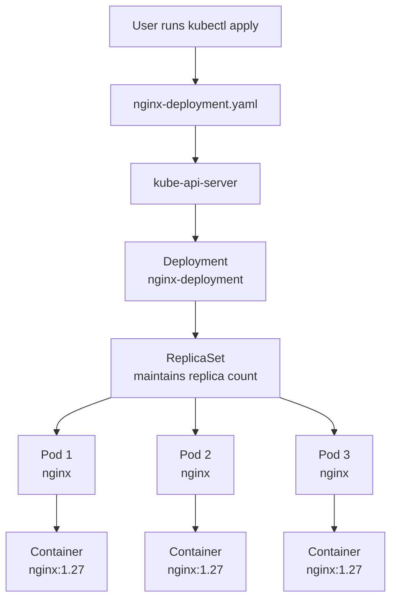

# Day 2 - YAML, Labels, Selectors, ReplicaSets, And Deployments

## Goal

Day 2 moves from a standalone Pod to a production-style Kubernetes workload called a Deployment.

By the end of this module, you should be able to:

- Understand why standalone Pods are not used for real application deployment.
- Understand the relationship between Deployment, ReplicaSet, and Pods.
- Write a Kubernetes Deployment YAML file.
- Use labels and selectors correctly.
- Deploy nginx using a Deployment.
- Scale the Deployment up and down.
- Perform a rolling update.
- Roll back to a previous version.
- Test Kubernetes self-healing by deleting a Pod.
- Debug common Deployment issues.

## Day 1 Recap

In Day 1, we created a Pod directly.

```text
Pod ---> Container ---> Image
```

This is useful for learning, but it is not a production-style deployment.

Problem with standalone Pods:

- If the Pod is deleted, it does not automatically come back.
- Scaling must be done manually.
- Rolling update is not available.
- Rollback is not available.
- There is no higher-level controller managing the Pod.

In real projects, we normally create Deployments instead of standalone Pods.

## What Is A Deployment?

A Deployment is a Kubernetes workload object used to manage stateless application Pods.

Simple meaning:

```text
Deployment manages Pods for us.
```

A Deployment provides:

- desired number of replicas
- automatic Pod replacement
- scaling
- rolling updates
- rollback
- self-healing

Real-time example:

```text
We want nginx application to always run with 3 Pods.
If one Pod is deleted or crashes, Kubernetes creates a replacement Pod.
If we update the nginx image, Kubernetes replaces old Pods with new Pods gradually.
```

## Deployment Flow

```text
Deployment ---> ReplicaSet ---> Pods ---> Containers
```

Explanation:

- Deployment manages the application rollout and desired state.
- Deployment creates a ReplicaSet.
- ReplicaSet maintains the required number of Pods.
- Pods run containers.
- Containers are created from images.

Example:

```text
Deployment name: nginx-deployment
Replicas: 3
Image: nginx:1.27
Result: Kubernetes keeps 3 nginx Pods running
```

## Architecture Diagram



## Deployment Vs Pod

| Standalone Pod | Deployment |
| --- | --- |
| Good for basic learning | Good for real applications |
| Does not recreate itself if deleted | Recreates failed or deleted Pods |
| No scaling feature | Supports replica scaling |
| No rollout history | Maintains rollout history |
| No rollback | Supports rollback |
| Manually managed | Controller managed |

Important point:

```text
In production, use Deployment for stateless applications.
Use standalone Pods only for basic learning or temporary debugging.
```

## What Is YAML In Kubernetes?

Kubernetes objects are usually written in YAML files.

A basic Kubernetes YAML file has four main sections:

```yaml
apiVersion:
kind:
metadata:
spec:
```

Meaning:

| Field | Meaning |
| --- | --- |
| `apiVersion` | Kubernetes API version used for this object. |
| `kind` | Type of Kubernetes object, such as Pod, Service, Deployment. |
| `metadata` | Object information such as name, namespace, and labels. |
| `spec` | Desired configuration of the object. |

For Deployment, we use:

```yaml
apiVersion: apps/v1
kind: Deployment
```

## What Are Labels?

Labels are key-value pairs attached to Kubernetes objects.

Simple meaning:

```text
Labels are tags for Kubernetes resources.
```

Example:

```yaml
labels:
  app: nginx
```

Why labels are used:

- to organize resources
- to filter resources
- to connect Services to Pods
- to connect Deployments and ReplicaSets to Pods

Command example:

```powershell
kubectl get pods -n day2 -l app=nginx
```

This means:

```text
Show Pods in namespace day2 where label app=nginx.
```

## What Are Selectors?

Selectors are used to select Kubernetes objects by labels.

Simple meaning:

```text
Selector finds matching Pods using labels.
```

Example:

```yaml
selector:
  matchLabels:
    app: nginx
```

This selector searches for Pods that have this label:

```yaml
labels:
  app: nginx
```

Very important rule:

```text
Deployment selector must match Pod template labels.
```

Correct matching example:

```yaml
selector:
  matchLabels:
    app: nginx

template:
  metadata:
    labels:
      app: nginx
```

If selector and labels do not match, the Deployment cannot manage the Pods correctly.

## What Is A ReplicaSet?

A ReplicaSet maintains a stable number of Pod replicas.

Simple meaning:

```text
ReplicaSet makes sure the required number of Pods are running.
```

Example:

```text
replicas: 3
```

If one Pod is deleted:

```text
Desired Pods: 3
Current Pods: 2
ReplicaSet action: create 1 replacement Pod
```

Important point:

```text
We usually do not create ReplicaSets directly.
We create Deployments, and Deployments create ReplicaSets automatically.
```

## Day 2 File Structure

```text
day2/
|-- README.md
|-- nginx-deployment.yaml
```

The practical manifest is:

```text
day2/nginx-deployment.yaml
```

## Deployment YAML

File: `day2/nginx-deployment.yaml`

```yaml
apiVersion: apps/v1
kind: Deployment
metadata:
  name: nginx-deployment
  namespace: day2
  labels:
    app: nginx
spec:
  replicas: 3
  selector:
    matchLabels:
      app: nginx
  template:
    metadata:
      labels:
        app: nginx
    spec:
      containers:
        - name: nginx
          image: nginx:1.27
          ports:
            - containerPort: 80
```

## YAML Line-By-Line Explanation

```yaml
apiVersion: apps/v1
```

Deployment belongs to the `apps/v1` API group.

```yaml
kind: Deployment
```

This creates a Deployment object.

```yaml
metadata:
  name: nginx-deployment
  namespace: day2
```

This sets the Deployment name and namespace.

```yaml
labels:
  app: nginx
```

This adds a label to the Deployment object.

```yaml
spec:
  replicas: 3
```

This tells Kubernetes to keep 3 Pods running.

```yaml
selector:
  matchLabels:
    app: nginx
```

This tells the Deployment to manage Pods with label `app=nginx`.

```yaml
template:
```

This is the Pod template. The Deployment uses this template to create Pods.

```yaml
template:
  metadata:
    labels:
      app: nginx
```

Every Pod created by this Deployment will get the label `app=nginx`.

```yaml
containers:
  - name: nginx
    image: nginx:1.27
```

This creates one container named `nginx` using the image `nginx:1.27`.

```yaml
ports:
  - containerPort: 80
```

This documents that nginx listens on port 80 inside the container.

## Practical Implementation

### Step 1: Check Cluster

Make sure Minikube is running and kubectl is connected.

```powershell
minikube status
kubectl config current-context
kubectl get nodes
kubectl get pods -A
```

Expected context:

```text
minikube
```

Expected node status:

```text
NAME       STATUS
minikube   Ready
```

If Minikube is not running:

```powershell
minikube start --driver=docker
```

### Step 2: Create Namespace

Create a separate namespace for Day 2:

```powershell
kubectl create namespace day2
```

Verify namespace:

```powershell
kubectl get namespace day2
```

Expected output:

```text
NAME   STATUS
day2   Active
```

If namespace already exists, you may see:

```text
Error from server (AlreadyExists): namespaces "day2" already exists
```

That is fine. You can continue, or reset the lab using:

```powershell
kubectl delete namespace day2
kubectl create namespace day2
```

### Step 3: Apply Deployment YAML

Apply the Deployment manifest:

```powershell
kubectl apply -f day2/nginx-deployment.yaml
```

Expected output:

```text
deployment.apps/nginx-deployment created
```

If the Deployment already exists, you may see:

```text
deployment.apps/nginx-deployment configured
```

### Step 4: Check Deployment

```powershell
kubectl get deployment -n day2
```

Expected output:

```text
NAME               READY   UP-TO-DATE   AVAILABLE
nginx-deployment   3/3     3            3
```

Meaning:

- `READY 3/3`: 3 Pods are ready out of 3 desired.
- `UP-TO-DATE 3`: 3 Pods match the current Deployment template.
- `AVAILABLE 3`: 3 Pods are available.

### Step 5: Check ReplicaSet

```powershell
kubectl get replicaset -n day2
```

Expected output:

```text
NAME                          DESIRED   CURRENT   READY
nginx-deployment-xxxxxxxxxx   3         3         3
```

Meaning:

```text
Deployment automatically created a ReplicaSet.
ReplicaSet is maintaining 3 Pods.
```

### Step 6: Check Pods

```powershell
kubectl get pods -n day2 -o wide
```

Expected output:

```text
NAME                                READY   STATUS    RESTARTS   IP            NODE
nginx-deployment-xxxxxxxxxx-abcde   1/1     Running   0          10.244.x.x    minikube
nginx-deployment-xxxxxxxxxx-fghij   1/1     Running   0          10.244.x.x    minikube
nginx-deployment-xxxxxxxxxx-klmno   1/1     Running   0          10.244.x.x    minikube
```

Meaning:

- 3 Pods are running.
- Each Pod has its own IP address.
- All Pods are running on the Minikube node.

### Step 7: Describe Deployment

```powershell
kubectl describe deployment nginx-deployment -n day2
```

Important fields to check:

- `Replicas`
- `Selector`
- `Pod Template`
- `Image`
- `OldReplicaSets`
- `NewReplicaSet`
- `Events`

### Step 8: Check Pods Using Label

```powershell
kubectl get pods -n day2 -l app=nginx
```

Meaning:

```text
Show Pods in day2 namespace with label app=nginx.
```

This proves labels and selectors are working.

## Scaling The Deployment

Scaling means increasing or decreasing the number of Pod replicas.

Current YAML says:

```yaml
replicas: 3
```

### Scale Up To 5 Replicas

```powershell
kubectl scale deployment nginx-deployment --replicas=5 -n day2
kubectl get deployment -n day2
kubectl get pods -n day2 -o wide
```

Expected result:

```text
nginx-deployment   5/5
```

Kubernetes creates 2 additional Pods.

### Scale Down To 2 Replicas

```powershell
kubectl scale deployment nginx-deployment --replicas=2 -n day2
kubectl get deployment -n day2
kubectl get pods -n day2 -o wide
```

Expected result:

```text
nginx-deployment   2/2
```

Kubernetes removes extra Pods and keeps only 2 running.

Important note:

```text
The YAML file still says replicas: 3.
The live cluster can become different if we scale using kubectl command.
If we apply the YAML again, Kubernetes will move back to 3 replicas.
```

## Rolling Update

A rolling update gradually replaces old Pods with new Pods.

Current image:

```text
nginx:1.27
```

Update image to:

```text
nginx:1.28
```

Run:

```powershell
kubectl set image deployment/nginx-deployment nginx=nginx:1.28 -n day2
kubectl rollout status deployment/nginx-deployment -n day2
```

Expected output:

```text
deployment "nginx-deployment" successfully rolled out
```

Check rollout history:

```powershell
kubectl rollout history deployment/nginx-deployment -n day2
```

Check ReplicaSets:

```powershell
kubectl get replicaset -n day2
```

Expected behavior:

```text
A new ReplicaSet is created for nginx:1.28.
The old ReplicaSet is scaled down.
The new ReplicaSet is scaled up.
```

## Rollback

Rollback is used to return to the previous Deployment version.

Run:

```powershell
kubectl rollout undo deployment/nginx-deployment -n day2
kubectl rollout status deployment/nginx-deployment -n day2
```

Check Deployment image:

```powershell
kubectl describe deployment nginx-deployment -n day2
```

Expected result:

```text
Image: nginx:1.27
```

Check rollout history again:

```powershell
kubectl rollout history deployment/nginx-deployment -n day2
```

Important point:

```text
Rollback creates a new revision number, even though it returns to an older template.
```

## Self-Healing Practical

Self-healing means Kubernetes repairs the workload automatically.

First list Pods:

```powershell
kubectl get pods -n day2
```

Delete one Pod:

```powershell
kubectl delete pod <pod-name> -n day2
```

Check Pods again:

```powershell
kubectl get pods -n day2
```

Expected behavior:

```text
The deleted Pod disappears.
ReplicaSet creates a replacement Pod.
Deployment returns to the desired replica count.
```

Check events:

```powershell
kubectl get events -n day2 --sort-by=.metadata.creationTimestamp
```

## Check Container Version

Get a Pod name:

```powershell
kubectl get pods -n day2
```

Run nginx version check inside one Pod:

```powershell
kubectl exec <pod-name> -n day2 -- nginx -v
```

Expected after rollback:

```text
nginx version: nginx/1.27.5
```

## Complete Day 2 Command Flow

Use this full command sequence from the repository root.

```powershell
# Start or verify cluster
minikube start --driver=docker
minikube status
kubectl config current-context
kubectl get nodes

# Create namespace
kubectl create namespace day2
kubectl get namespace day2

# Deploy application
kubectl apply -f day2/nginx-deployment.yaml

# Verify Deployment, ReplicaSet, and Pods
kubectl get deployment -n day2
kubectl get replicaset -n day2
kubectl get pods -n day2 -o wide
kubectl describe deployment nginx-deployment -n day2

# Check labels
kubectl get pods -n day2 -l app=nginx

# Scale up
kubectl scale deployment nginx-deployment --replicas=5 -n day2
kubectl get deployment -n day2
kubectl get pods -n day2 -o wide

# Scale down
kubectl scale deployment nginx-deployment --replicas=2 -n day2
kubectl get deployment -n day2
kubectl get pods -n day2 -o wide

# Rolling update
kubectl set image deployment/nginx-deployment nginx=nginx:1.28 -n day2
kubectl rollout status deployment/nginx-deployment -n day2
kubectl rollout history deployment/nginx-deployment -n day2
kubectl get replicaset -n day2

# Rollback
kubectl rollout undo deployment/nginx-deployment -n day2
kubectl rollout status deployment/nginx-deployment -n day2
kubectl rollout history deployment/nginx-deployment -n day2
kubectl describe deployment nginx-deployment -n day2

# Self-healing test
kubectl get pods -n day2
kubectl delete pod <pod-name> -n day2
kubectl get pods -n day2
kubectl get events -n day2 --sort-by=.metadata.creationTimestamp
```

## Troubleshooting

### Namespace Not Found

Error:

```text
Error from server (NotFound): namespaces "day2" not found
```

Fix:

```powershell
kubectl create namespace day2
```

### Namespace Already Exists

Error:

```text
Error from server (AlreadyExists): namespaces "day2" already exists
```

Meaning:

```text
The namespace already exists. You can continue.
```

To reset the lab:

```powershell
kubectl delete namespace day2
kubectl create namespace day2
```

### Selector Does Not Match Template Labels

Problem example:

```yaml
selector:
  matchLabels:
    app: nginx

template:
  metadata:
    labels:
      app: web
```

This is wrong because selector says `app=nginx`, but Pod label says `app=web`.

Correct:

```yaml
selector:
  matchLabels:
    app: nginx

template:
  metadata:
    labels:
      app: nginx
```

### ImagePullBackOff

Meaning:

```text
Kubernetes cannot pull the container image.
```

Possible reasons:

- wrong image name
- wrong image tag
- internet issue
- registry access issue

Debug:

```powershell
kubectl describe pod <pod-name> -n day2
kubectl get events -n day2 --sort-by=.metadata.creationTimestamp
```

### Live Replicas Different From YAML

Example:

```text
YAML says replicas: 3
Live cluster shows 2 replicas
```

Reason:

```text
kubectl scale changed the live desired state.
```

Fix:

```powershell
kubectl apply -f day2/nginx-deployment.yaml
```

This returns the Deployment to the YAML value.

## Cleanup

Delete all Day 2 resources:

```powershell
kubectl delete namespace day2
```

Or delete only the Deployment:

```powershell
kubectl delete -f day2/nginx-deployment.yaml
```

## Student Practice Tasks

1. Create namespace `day2`.
2. Apply `day2/nginx-deployment.yaml`.
3. Verify Deployment, ReplicaSet, and Pods.
4. Scale Deployment from 3 replicas to 5 replicas.
5. Scale Deployment from 5 replicas to 2 replicas.
6. Update nginx image from `nginx:1.27` to `nginx:1.28`.
7. Check rollout status and rollout history.
8. Roll back to the previous nginx version.
9. Delete one Pod and verify Kubernetes creates a replacement.
10. Explain why Deployment is better than a standalone Pod.

## Interview Questions

### What is a Deployment?

A Deployment is a Kubernetes workload object used to manage stateless application Pods. It supports replicas, scaling, rolling updates, rollback, and self-healing.

### What is a ReplicaSet?

A ReplicaSet maintains the desired number of Pod replicas. Deployments create and manage ReplicaSets automatically.

### Why do we use Deployment instead of a standalone Pod?

A standalone Pod does not automatically recover, scale, roll out updates, or roll back. A Deployment provides these management features.

### What are labels?

Labels are key-value tags used to organize and select Kubernetes objects.

### What are selectors?

Selectors are rules used to select Kubernetes objects based on labels.

### Why must selector labels match Pod template labels?

The Deployment uses selectors to identify the Pods it manages. If the selector and Pod template labels do not match, the Deployment cannot manage its Pods correctly.

### What happens when a Pod managed by a Deployment is deleted?

The ReplicaSet creates a replacement Pod to maintain the desired replica count.

### What is a rolling update?

A rolling update gradually replaces old Pods with new Pods so an application can be updated with minimal downtime.

### What is rollback?

Rollback returns a Deployment to a previous revision when a new rollout has an issue.

### What is the difference between desired state and actual state?

Desired state is what we define in YAML or through kubectl commands. Actual state is what is currently running in the cluster. Kubernetes continuously tries to make actual state match desired state.

## Completion Checklist

- [ ] Namespace `day2` created.
- [ ] Deployment manifest applied.
- [ ] Deployment shows available replicas.
- [ ] ReplicaSet created automatically.
- [ ] Pods are running.
- [ ] Labels and selectors verified.
- [ ] Deployment scaled up and down.
- [ ] Image update performed.
- [ ] Rollout history checked.
- [ ] Rollback performed.
- [ ] Self-healing demonstrated by deleting a Pod.

## Local Lab Output

Date:

```text
July 9, 2026
```

Cluster:

```text
Context: minikube
Node: minikube
Node status: Ready
Kubernetes version: v1.33.1
```

Deployment after initial apply:

```text
NAME               READY   UP-TO-DATE   AVAILABLE
nginx-deployment   3/3     3            3
```

ReplicaSet after initial apply:

```text
NAME                          DESIRED   CURRENT   READY
nginx-deployment-66fc78d4b8   3         3         3
```

Scale test:

```text
Scaled up:   3 replicas -> 5 replicas
Scaled down: 5 replicas -> 2 replicas
```

Rolling update:

```text
Updated image: nginx:1.27 -> nginx:1.28
Rollout result: deployment successfully rolled out
New ReplicaSet: nginx-deployment-59688fc659
Old ReplicaSet: nginx-deployment-66fc78d4b8 scaled to 0
```

Rollback:

```text
Rollback result: deployment successfully rolled out
Active image after rollback: nginx:1.27
Container check: nginx version: nginx/1.27.5
```

Self-healing validation:

```text
Deleted pod: nginx-deployment-66fc78d4b8-7mk6p
Replacement pod created: nginx-deployment-66fc78d4b8-99xj9
Deployment returned to: 2/2 available
```
