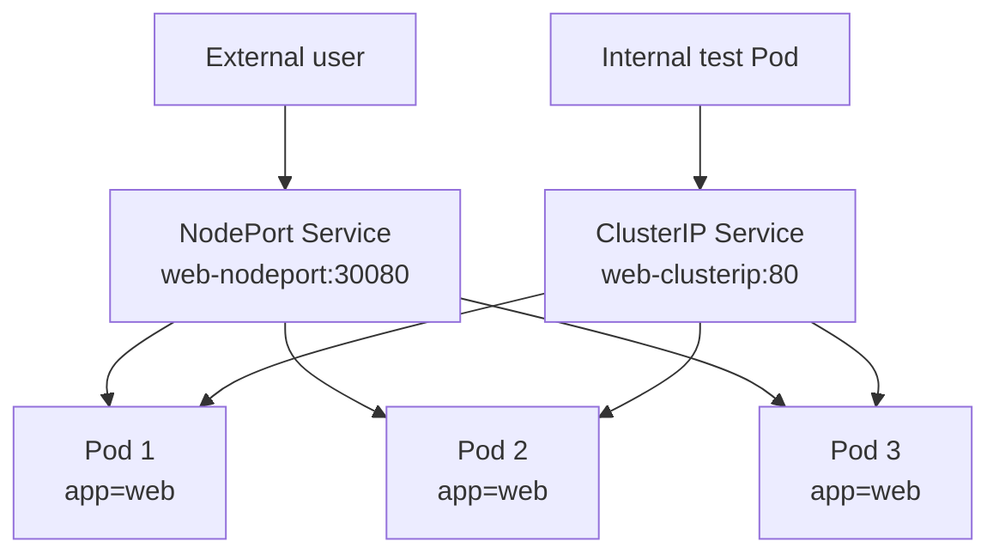

# Day 3 - Services And Kubernetes Networking

## Goal

Day 3 explains how applications communicate inside and outside a Kubernetes cluster.

By the end of this module, you should be able to:

- Understand why Pods should not be accessed directly by Pod IP.
- Explain Kubernetes Service networking.
- Create a Deployment with multiple Pods.
- Expose Pods using a ClusterIP Service.
- Expose Pods using a NodePort Service.
- Understand `port`, `targetPort`, and `nodePort`.
- Test internal access from inside the cluster.
- Test external access through Minikube NodePort.
- Debug Service selector and endpoint issues.

## Day 2 Recap

In Day 2, we learned this flow:

```text
Deployment ---> ReplicaSet ---> Pods
```

A Deployment manages Pods and keeps the desired replica count.

In Day 3, we add networking:

```text
Service ---> Pods
```

The Service gives a stable way to reach Pods.

## Why Services Are Needed

Pods are temporary.

If a Pod is deleted or recreated, it can get a new IP address.

Example:

```text
Old Pod IP: 10.244.0.10
Pod deleted
New Pod IP: 10.244.0.15
```

Problem:

```text
If another application uses the old Pod IP, communication breaks.
```

Solution:

```text
Use a Kubernetes Service.
```

A Service gives a stable name and stable virtual IP for a group of Pods.

## Service Flow

```text
Client ---> Service ---> Matching Pods
```

Example:

```text
frontend Pod ---> backend Service ---> backend Pods
```

The frontend does not need to know backend Pod IP addresses.
It only needs to call the backend Service name.

## Service And Selector Relationship

A Service finds Pods using labels and selectors.

Pod label:

```yaml
labels:
  app: web
```

Service selector:

```yaml
selector:
  app: web
```

Meaning:

```text
Send traffic to Pods where app=web.
```

Important rule:

```text
Service selector must match Pod labels.
```

If labels and selectors do not match, the Service will have no endpoints.

## Networking Architecture



## Kubernetes Service Types

| Service Type | Usage |
| --- | --- |
| ClusterIP | Internal access inside the cluster. |
| NodePort | External access using Node IP and NodePort. |
| LoadBalancer | External load balancer in cloud platforms. |
| ExternalName | Maps a Kubernetes Service name to an external DNS name. |

## ClusterIP

ClusterIP is the default Service type.

Simple meaning:

```text
ClusterIP exposes the application inside the cluster only.
```

Use case:

```text
frontend Pod ---> backend ClusterIP Service ---> backend Pods
```

ClusterIP is not directly accessible from your laptop browser unless you use port-forwarding.

## NodePort

NodePort exposes a Service on a port of the Kubernetes node.

Simple meaning:

```text
NodePort allows access from outside the cluster.
```

Format:

```text
NodeIP:NodePort
```

NodePort range:

```text
30000 - 32767
```

Example:

```text
192.168.49.2:30080
```

For Minikube, first check the Minikube node IP and NodePort:

```powershell
minikube ip
minikube ssh -- curl -I http://<minikube-ip>:30080/
```

## LoadBalancer

LoadBalancer is commonly used in cloud Kubernetes environments.

Examples:

- AWS EKS
- Azure AKS
- Google GKE

In cloud:

```text
LoadBalancer Service ---> Cloud load balancer ---> Pods
```

In Minikube, LoadBalancer may stay pending unless `minikube tunnel` is used.

For Day 3 local learning, focus mainly on:

```text
ClusterIP and NodePort
```

## ExternalName

ExternalName maps a Kubernetes Service name to an external DNS name.

Example use case:

```text
Application inside Kubernetes calls external API using a Kubernetes service name.
```

Important:

```text
ExternalName does not use selectors.
ExternalName does not send traffic to Pods.
It maps to an external DNS name.
```

## port, targetPort, And nodePort

These three fields are very important.

```yaml
ports:
  - port: 80
    targetPort: 80
    nodePort: 30080
```

Meaning:

| Field | Meaning |
| --- | --- |
| `port` | Port exposed by the Service inside the cluster. |
| `targetPort` | Port on the container where traffic should be sent. |
| `nodePort` | Port exposed on the node for external access. |

Example:

```text
Browser ---> NodePort 30080 ---> Service port 80 ---> Pod targetPort 80 ---> nginx container
```

Important:

```text
targetPort must match the container application's listening port.
nginx listens on port 80, so targetPort should be 80.
```

## Day 3 File Structure

```text
day3/
|-- README.md
|-- web-deployment.yaml
|-- clusterip-service.yaml
|-- nodeport-service.yaml
```

## Deployment YAML

File: `day3/web-deployment.yaml`

```yaml
apiVersion: apps/v1
kind: Deployment
metadata:
  name: web
  namespace: day3
  labels:
    app: web
spec:
  replicas: 3
  selector:
    matchLabels:
      app: web
  template:
    metadata:
      labels:
        app: web
    spec:
      containers:
        - name: nginx
          image: nginx:1.27
          ports:
            - containerPort: 80
```

Key point:

```text
The Pods created by this Deployment have label app=web.
Services will use selector app=web to send traffic to these Pods.
```

## ClusterIP Service YAML

File: `day3/clusterip-service.yaml`

```yaml
apiVersion: v1
kind: Service
metadata:
  name: web-clusterip
  namespace: day3
spec:
  type: ClusterIP
  selector:
    app: web
  ports:
    - protocol: TCP
      port: 80
      targetPort: 80
```

Explanation:

- `type: ClusterIP` exposes the application inside the cluster.
- `selector: app: web` sends traffic to Pods with label `app=web`.
- `port: 80` is the Service port.
- `targetPort: 80` is the nginx container port.

## NodePort Service YAML

File: `day3/nodeport-service.yaml`

```yaml
apiVersion: v1
kind: Service
metadata:
  name: web-nodeport
  namespace: day3
spec:
  type: NodePort
  selector:
    app: web
  ports:
    - protocol: TCP
      port: 80
      targetPort: 80
      nodePort: 30080
```

Explanation:

- `type: NodePort` exposes the application outside the cluster.
- `nodePort: 30080` is the external port on the node.
- NodePort range is `30000-32767`.

## Practical Implementation

### Step 1: Check Cluster

```powershell
minikube status
kubectl config current-context
kubectl get nodes
kubectl get pods -A
```

Expected context:

```text
minikube
```

Expected node:

```text
minikube Ready
```

If Minikube is stopped:

```powershell
minikube start --driver=docker
```

### Step 2: Create Namespace

```powershell
kubectl create namespace day3
kubectl get namespace day3
```

Expected output:

```text
day3 Active
```

### Step 3: Deploy The Web Application

```powershell
kubectl apply -f day3/web-deployment.yaml
```

Verify:

```powershell
kubectl get deployment -n day3
kubectl get pods -n day3 -o wide
```

Expected:

```text
web   3/3
```

### Step 4: Create ClusterIP Service

```powershell
kubectl apply -f day3/clusterip-service.yaml
```

Verify:

```powershell
kubectl get svc -n day3
kubectl describe svc web-clusterip -n day3
kubectl get endpoints -n day3
```

Expected:

```text
web-clusterip   ClusterIP   <cluster-ip>   80/TCP
```

Endpoints should show Pod IPs.

### Step 5: Test ClusterIP From Inside The Cluster

Create a temporary test Pod:

```powershell
kubectl run network-client -n day3 --image=busybox:1.36 --restart=Never --command -- sleep 3600
```

Wait until it is running:

```powershell
kubectl get pod network-client -n day3
```

Call the ClusterIP Service from inside the cluster:

```powershell
kubectl exec network-client -n day3 -- wget -qO- http://web-clusterip
```

Expected output:

```text
Welcome to nginx!
```

You can also test the full DNS name:

```powershell
kubectl exec network-client -n day3 -- wget -qO- http://web-clusterip.day3.svc.cluster.local
```

### Step 6: Create NodePort Service

```powershell
kubectl apply -f day3/nodeport-service.yaml
```

Verify:

```powershell
kubectl get svc web-nodeport -n day3
kubectl describe svc web-nodeport -n day3
```

Expected:

```text
web-nodeport   NodePort   <cluster-ip>   80:30080/TCP
```

### Step 7: Test NodePort Access

First verify the NodePort Service:

```powershell
kubectl get svc web-nodeport -n day3
```

Expected output:

```text
web-nodeport   NodePort   <cluster-ip>   80:30080/TCP
```

Get the Minikube node IP:

```powershell
minikube ip
```

Validate NodePort from inside the Minikube node:

```powershell
minikube ssh -- curl -I http://<minikube-ip>:30080/
```

Example:

```powershell
minikube ssh -- curl -I http://192.168.49.2:30080/
```

Expected:

```text
HTTP/1.1 200 OK
Server: nginx/1.27.5
```

For host-machine access, try:

```powershell
minikube service web-nodeport -n day3 --url
```

If it returns a URL, test it:

```powershell
Invoke-WebRequest -UseBasicParsing <URL>
```

Windows Docker driver note:

```text
Direct NodePort access from Windows may not work in every Docker-driver setup.
If direct NodePort access fails, use kubectl port-forward for local browser testing.
```

### Step 9: Port Forward ClusterIP Service

ClusterIP is internal, but we can test it from the laptop using port-forward:

```powershell
kubectl port-forward svc/web-clusterip -n day3 8080:80
```

Open:

```text
http://localhost:8080
```

Stop port-forward using `Ctrl+C`.

## Complete Day 3 Command Flow

```powershell
# Start or verify cluster
minikube start --driver=docker
minikube status
kubectl config current-context
kubectl get nodes

# Create namespace
kubectl create namespace day3
kubectl get namespace day3

# Deploy application
kubectl apply -f day3/web-deployment.yaml
kubectl get deployment -n day3
kubectl get pods -n day3 -o wide

# Create ClusterIP service
kubectl apply -f day3/clusterip-service.yaml
kubectl get svc -n day3
kubectl describe svc web-clusterip -n day3
kubectl get endpoints -n day3

# Test ClusterIP inside cluster
kubectl run network-client -n day3 --image=busybox:1.36 --restart=Never --command -- sleep 3600
kubectl get pod network-client -n day3
kubectl exec network-client -n day3 -- wget -qO- http://web-clusterip

# Create NodePort service
kubectl apply -f day3/nodeport-service.yaml
kubectl get svc web-nodeport -n day3

# Validate NodePort from Minikube node
minikube ip
minikube ssh -- curl -I http://<minikube-ip>:30080/

# Host-machine test with port-forward
# Terminal 1 - keep this running
kubectl port-forward svc/web-clusterip -n day3 8080:80

# Terminal 2 - test while port-forward is running
Invoke-WebRequest -UseBasicParsing http://127.0.0.1:8080/
```

## Troubleshooting

### Service Has No Endpoints

Check:

```powershell
kubectl get endpoints -n day3
```

If endpoints are empty, check labels:

```powershell
kubectl get pods -n day3 --show-labels
kubectl describe svc web-clusterip -n day3
```

Common cause:

```text
Service selector does not match Pod labels.
```

Fix:

```text
Make Service selector match Pod label exactly.
```

### NodePort URL Does Not Open

Check Service:

```powershell
kubectl get svc web-nodeport -n day3
minikube service web-nodeport -n day3 --url
```

If `minikube service --url` does not return a working URL on Docker Desktop, validate NodePort from inside the Minikube node and use port-forward for browser testing.

### ClusterIP Does Not Work From Browser

This is expected.

ClusterIP is internal only.

Use one of these:

```powershell
kubectl exec network-client -n day3 -- wget -qO- http://web-clusterip
kubectl port-forward svc/web-clusterip -n day3 8080:80
```

### Wrong targetPort

If nginx listens on port 80:

```yaml
targetPort: 80
```

If you use a wrong targetPort, traffic will not reach the container.

## Cleanup

Delete all Day 3 resources:

```powershell
kubectl delete namespace day3
```

Or delete individual resources:

```powershell
kubectl delete -f day3/nodeport-service.yaml
kubectl delete -f day3/clusterip-service.yaml
kubectl delete -f day3/web-deployment.yaml
kubectl delete pod network-client -n day3
```

## Student Practice Tasks

1. Create namespace `day3`.
2. Deploy the web application using `web-deployment.yaml`.
3. Create ClusterIP Service.
4. Check Service endpoints.
5. Create a temporary test Pod.
6. Access ClusterIP Service from inside the cluster.
7. Create NodePort Service.
8. Validate NodePort from the Minikube node.
9. Access nginx from the host using Minikube URL or port-forward.
10. Explain the difference between `port`, `targetPort`, and `nodePort`.

## Interview Questions

### Why do we need a Service in Kubernetes?

Pods are temporary and Pod IPs can change. A Service provides stable access to a group of Pods.

### What is ClusterIP?

ClusterIP is the default Service type. It exposes the application only inside the cluster.

### What is NodePort?

NodePort exposes the application outside the cluster using a node IP and a port from the `30000-32767` range.

### What is LoadBalancer?

LoadBalancer creates or integrates with an external load balancer in cloud environments such as AWS, Azure, or GCP.

### What is ExternalName?

ExternalName maps a Kubernetes Service name to an external DNS name. It does not use selectors and does not expose Pods.

### What is the difference between port and targetPort?

`port` is the Service port. `targetPort` is the container port where traffic is forwarded.

### What is nodePort?

`nodePort` is the port opened on the Kubernetes node for external access.

### How does a Service know which Pods to send traffic to?

A Service uses selectors to match Pod labels.

### What happens if Service selector does not match Pod labels?

The Service will have no endpoints, so traffic will not reach any Pod.

### Can ClusterIP be accessed directly from a browser on your laptop?

No. ClusterIP is internal to the cluster. Use a test Pod, port-forward, NodePort, or LoadBalancer.

## Completion Checklist

- [x] Namespace `day3` created.
- [x] Web Deployment applied.
- [x] 3 nginx Pods running.
- [x] ClusterIP Service created.
- [x] ClusterIP endpoints verified.
- [x] Internal cluster access tested.
- [x] NodePort Service created.
- [x] NodePort validated from Minikube node; host access validated with port-forward.
- [x] Difference between `port`, `targetPort`, and `nodePort` understood.

## Local Lab Output

Date:

```text
July 9, 2026
```

Cluster:

```text
Context: minikube
Node: minikube
Node status: Ready
Kubernetes version: v1.33.1
```

Deployment:

```text
NAME   READY   UP-TO-DATE   AVAILABLE   CONTAINERS   IMAGES       SELECTOR
web    3/3     3            3           nginx        nginx:1.27   app=web
```

Pods:

```text
web-5c78f69c86-5xpt2   1/1   Running   10.244.0.23   minikube
web-5c78f69c86-rgzj2   1/1   Running   10.244.0.24   minikube
web-5c78f69c86-nmvjn   1/1   Running   10.244.0.25   minikube
```

Services:

```text
NAME            TYPE        CLUSTER-IP      PORT(S)        SELECTOR
web-clusterip   ClusterIP   10.102.38.244   80/TCP         app=web
web-nodeport    NodePort    10.99.255.74    80:30080/TCP   app=web
```

Endpoints:

```text
web-clusterip   10.244.0.23:80,10.244.0.24:80,10.244.0.25:80
web-nodeport    10.244.0.23:80,10.244.0.24:80,10.244.0.25:80
```

EndpointSlices:

```text
web-clusterip-57mbn   IPv4   80   10.244.0.24,10.244.0.25,10.244.0.23
web-nodeport-t9pf6    IPv4   80   10.244.0.23,10.244.0.24,10.244.0.25
```

Internal ClusterIP test from `network-client` Pod:

```text
kubectl exec network-client -n day3 -- wget -qO- http://web-clusterip
Result: Welcome to nginx!
```

Full DNS test from `network-client` Pod:

```text
kubectl exec network-client -n day3 -- wget -qO- http://web-clusterip.day3.svc.cluster.local
Result: Welcome to nginx!
```

Direct ClusterIP test from `network-client` Pod:

```text
kubectl exec network-client -n day3 -- wget -qO- http://10.102.38.244
Result: Welcome to nginx!
```

NodePort validation from Minikube node:

```text
minikube ssh -- curl -I http://192.168.49.2:30080/
HTTP/1.1 200 OK
Server: nginx/1.27.5
```

Host access validation with port-forward:

```text
# Terminal 1 - keep this running
kubectl port-forward svc/web-clusterip -n day3 8080:80

# Terminal 2 - test while port-forward is running
Invoke-WebRequest -UseBasicParsing http://127.0.0.1:8080/
StatusCode: 200
ContentCheck: Welcome to nginx!
```

Windows Docker driver note:

```text
Direct access to http://192.168.49.2:30080 from Windows did not connect in this environment.
The NodePort itself was valid from inside the Minikube node.
For local browser testing on Windows, use minikube service --url if it returns a tunnel URL, or use kubectl port-forward.
```


