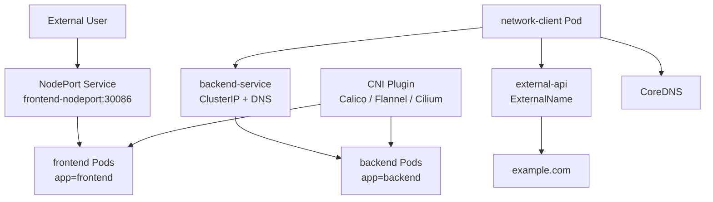

# Day 6 - Kubernetes Networking Deep Dive

## Goal

Day 6 explains how communication works inside and outside a Kubernetes cluster.

By the end of this module, students should be able to:

- Explain Kubernetes networking in simple terms.
- Understand Pod networking.
- Understand container-to-container communication inside one Pod.
- Understand Pod-to-Pod communication.
- Understand Pod-to-Service communication.
- Understand Service DNS.
- Understand ClusterIP, NodePort, LoadBalancer, and ExternalName Services.
- Understand Ingress and egress traffic.
- Understand why CNI plugins are required.
- Explain common CNI plugins such as Flannel, Calico, Weave Net, and Cilium.
- Understand Kubernetes IP ranges for Pods, Services, and Nodes.
- Start Minikube with Calico CNI.
- Inspect Pod IPs, node IPs, Service IPs, cluster information, and network policies.
- Debug common networking issues.

## What Is Kubernetes Networking?

Kubernetes networking defines how components communicate:

```text
Container ---> Container
Pod -------> Pod
Pod -------> Service
Service ---> Pod endpoints
External client ---> Ingress or NodePort ---> Service ---> Pods
Pod -------> External service
```

Simple explanation:

```text
Kubernetes networking is the communication system for Pods, Services, Nodes, and external clients.
```

## Networking Architecture



## Day 6 Project Files

```text
day6/
|-- README.md
|-- manifests/
|   |-- 00-namespace.yaml
|   |-- 01-frontend-deployment.yaml
|   |-- 02-frontend-nodeport-service.yaml
|   |-- 03-backend-deployment.yaml
|   |-- 04-backend-clusterip-service.yaml
|   |-- 05-externalname-service.yaml
|   |-- 06-network-client-pod.yaml
|   |-- 07-deny-egress-networkpolicy.yaml
|   |-- 08-allow-dns-and-backend-egress.yaml
```

## 1. Pod Networking

In Kubernetes, every Pod gets its own IP address.

Important points:

```text
1. Each Pod gets a unique IP address.
2. Containers inside the same Pod share the same network namespace.
3. Containers inside the same Pod can communicate using localhost.
4. Pods can communicate with other Pods using Pod IPs.
```

Example:

```text
Pod A IP: 10.244.0.10
Pod B IP: 10.244.0.11
Pod A can call Pod B using 10.244.0.11 if networking allows it.
```

Important production point:

```text
Pod IPs are not stable.
If a Pod is deleted and recreated, it can get a new IP.
Use Services for stable access.
```

## Container-To-Container Communication

If two containers run inside the same Pod, they share:

- same IP address
- same network namespace
- same localhost
- same port space

Example:

```text
Container A in Pod ---> http://localhost:8080 ---> Container B in same Pod
```

Important:

```text
Two containers in the same Pod cannot use the same container port at the same time.
They share the same network namespace.
```

## Pod-To-Pod Communication

Kubernetes networking expects Pods to communicate with each other without manual NAT.

Example:

```text
frontend Pod ---> backend Pod IP
```

But in real projects, direct Pod IP access is avoided because Pod IPs change.

Better approach:

```text
frontend Pod ---> backend Service DNS ---> backend Pods
```

## 2. Cluster Networking

Cluster networking means communication across the whole Kubernetes cluster.

It includes:

```text
1. Container-to-container communication
2. Pod-to-Pod communication
3. Pod-to-Service communication
4. External-to-Service communication
5. Pod-to-external-service communication
```

Kubernetes cluster networking is implemented by a network plugin through CNI.

## 3. CNI - Container Network Interface

CNI means Container Network Interface.

Simple explanation:

```text
CNI is the plugin system used to configure Pod networking.
```

CNI is responsible for:

- assigning Pod network interfaces
- connecting Pods to the cluster network
- routing Pod traffic
- enforcing NetworkPolicy if the plugin supports it

Common CNI plugins:

| CNI Plugin | Common Use |
| --- | --- |
| Flannel | Simple overlay networking |
| Calico | Networking plus NetworkPolicy support |
| Weave Net | Overlay networking and optional encryption features |
| Cilium | eBPF-based networking, security, and observability |

For this Day 6 practical, use Calico because it supports NetworkPolicy clearly.

## Start Minikube With Calico

If you already have an old Minikube cluster and want a fresh Calico networking lab, delete and start again:

```powershell
minikube delete
minikube start --driver=docker --cni=calico
```

If the cluster already exists with a different CNI, `--cni=calico` may not replace it cleanly. A fresh Minikube profile is best for this lab.

Check cluster details:

```powershell
kubectl cluster-info
kubectl get nodes -o wide
kubectl get pods -n kube-system
```

Check Calico Pods:

```powershell
kubectl get pods -n kube-system | Select-String calico
```

Linux/macOS equivalent:

```bash
kubectl get pods -n kube-system | grep calico
```

## 4. Kubernetes IP Address Ranges

Kubernetes commonly has different IP ranges for different purposes.

| IP Type | Purpose | Example |
| --- | --- | --- |
| Node IP | IP address of Kubernetes node | `192.168.49.2` |
| Pod CIDR | Range used for Pod IPs | `10.244.0.0/16` |
| Service CIDR | Range used for Service ClusterIPs | `10.96.0.0/12` |
| Cluster DNS IP | DNS Service IP inside cluster | `10.96.0.10` |

Important clarification:

```text
The CNI plugin assigns Pod networking.
The control plane allocates Service ClusterIPs from the Service CIDR.
Nodes get IPs from the host, VM, cloud, or local runtime; kubelet reports node status and node IP information to the API server.
```

Commands:

```powershell
kubectl get nodes -o wide
kubectl get pods -n day6 -o wide
kubectl get svc -n day6 -o wide
```

Check Pod CIDR from nodes:

```powershell
kubectl get nodes -o jsonpath="{.items[*].spec.podCIDR}"
```

Check Service cluster IP range from API server manifest in Minikube:

```powershell
minikube ssh -- sudo grep service-cluster-ip-range /etc/kubernetes/manifests/kube-apiserver.yaml
```

Check cluster CIDR from controller manager manifest:

```powershell
minikube ssh -- sudo grep cluster-cidr /etc/kubernetes/manifests/kube-controller-manager.yaml
```

Your note used this command:

```bash
kubectl cluster-info dump | grep -m 1 cluster-cidr
```

PowerShell equivalent:

```powershell
kubectl cluster-info dump | Select-String -Pattern "cluster-cidr" | Select-Object -First 1
```

## 5. Service Networking

A Service provides a stable virtual IP and DNS name for a group of Pods.

Why Service is needed:

```text
Pod IPs change.
Service IP and Service DNS stay stable.
```

Service flow:

```text
Client Pod ---> Service DNS/ClusterIP ---> Matching Pods
```

Service finds Pods using labels and selectors.

Example Service selector:

```yaml
selector:
  app: backend
```

Meaning:

```text
Send traffic to Pods where app=backend.
```

## Service Types

| Service Type | Purpose |
| --- | --- |
| ClusterIP | Internal access inside the cluster |
| NodePort | Exposes Service on every node IP and a static port |
| LoadBalancer | Creates a cloud load balancer in supported environments |
| ExternalName | Maps a Service name to an external DNS name |

Day 6 uses:

```text
backend-service        ---> ClusterIP
frontend-nodeport      ---> NodePort
external-api           ---> ExternalName
```

## 6. DNS For Services

Kubernetes normally runs CoreDNS for cluster DNS.

Service DNS format:

```text
service-name.namespace.svc.cluster.local
```

Examples:

```text
backend-service
backend-service.day6
backend-service.day6.svc.cluster.local
```

From a Pod in the same namespace, short name works:

```powershell
kubectl exec -n day6 network-client -- wget -qO- http://backend-service
```

From a different namespace, use a longer name:

```text
backend-service.day6.svc.cluster.local
```

## 7. Ingress And Egress Networking

Ingress traffic means traffic coming into the cluster or application.

Examples:

```text
User ---> Ingress ---> Service ---> Pods
User ---> NodePort ---> Service ---> Pods
```

Egress traffic means traffic going out from a Pod.

Examples:

```text
Pod ---> external database
Pod ---> external API
Pod ---> internet
Pod ---> another internal Service
```

In Day 6, we use NetworkPolicy examples to show how egress can be controlled.

## 8. NetworkPolicy

NetworkPolicy controls traffic to and from selected Pods.

Important:

```text
NetworkPolicy works only if the CNI plugin supports and enforces it.
Calico and Cilium support NetworkPolicy.
Some simple networking plugins may not enforce NetworkPolicy.
```

Day 6 includes two NetworkPolicies:

```text
07-deny-egress-networkpolicy.yaml
08-allow-dns-and-backend-egress.yaml
```

The first policy blocks all egress from `network-client`.

The second policy allows:

```text
DNS traffic to kube-system DNS
HTTP traffic to backend Pods
```

This demonstrates practical egress control.

## Practical 1 - Apply Networking Lab

Start with Calico:

```powershell
minikube delete
minikube start --driver=docker --cni=calico
```

Apply manifests:

```powershell
kubectl apply -f day6/manifests/00-namespace.yaml
kubectl apply -f day6/manifests/01-frontend-deployment.yaml
kubectl apply -f day6/manifests/02-frontend-nodeport-service.yaml
kubectl apply -f day6/manifests/03-backend-deployment.yaml
kubectl apply -f day6/manifests/04-backend-clusterip-service.yaml
kubectl apply -f day6/manifests/05-externalname-service.yaml
kubectl apply -f day6/manifests/06-network-client-pod.yaml
```

Wait for workloads:

```powershell
kubectl rollout status deployment/frontend -n day6
kubectl rollout status deployment/backend -n day6
kubectl wait --for=condition=Ready pod/network-client -n day6 --timeout=120s
```

Inspect Pods and IPs:

```powershell
kubectl get pods -n day6 -o wide
kubectl get svc -n day6 -o wide
kubectl get endpoints -n day6
kubectl get endpointslice -n day6
```

## Practical 2 - Pod-To-Service Communication

Test backend Service DNS:

```powershell
kubectl exec -n day6 network-client -- wget -qO- http://backend-service
```

Test full DNS name:

```powershell
kubectl exec -n day6 network-client -- wget -qO- http://backend-service.day6.svc.cluster.local
```

Expected:

```text
Backend API
Reached through ClusterIP Service DNS
```

## Practical 3 - NodePort Access

Check NodePort:

```powershell
kubectl get svc frontend-nodeport -n day6
minikube ip
```

Validate from inside Minikube node:

```powershell
minikube ssh -- curl -I http://<minikube-ip>:30086
```

On Windows Docker driver, direct host browser access to NodePort can vary. If needed, use port-forward:

```powershell
kubectl port-forward svc/frontend-nodeport -n day6 8086:80
```

Test from another terminal:

```powershell
Invoke-WebRequest -UseBasicParsing http://127.0.0.1:8086
```

## Practical 4 - ExternalName And Egress

Check ExternalName:

```powershell
kubectl get svc external-api -n day6
kubectl describe svc external-api -n day6
```

Test egress DNS:

```powershell
kubectl exec -n day6 network-client -- nslookup external-api.day6.svc.cluster.local
```

Test outbound internet:

```powershell
kubectl exec -n day6 network-client -- wget -qO- http://example.com
```

If outbound internet fails, check:

- Docker Desktop networking
- corporate proxy
- firewall
- DNS resolution
- NetworkPolicy

## Practical 5 - Egress NetworkPolicy

Apply deny egress:

```powershell
kubectl apply -f day6/manifests/07-deny-egress-networkpolicy.yaml
```

Test backend Service:

```powershell
kubectl exec -n day6 network-client -- wget -T 5 -qO- http://backend-service
```

Expected:

```text
Connection should fail or time out because all egress is denied.
```

Apply allow policy:

```powershell
kubectl apply -f day6/manifests/08-allow-dns-and-backend-egress.yaml
```

Test backend again:

```powershell
kubectl exec -n day6 network-client -- wget -qO- http://backend-service
```

Expected:

```text
Backend access works again because DNS and backend egress are allowed.
```

Test external internet:

```powershell
kubectl exec -n day6 network-client -- wget -T 5 -qO- http://example.com
```

Expected:

```text
External internet may still fail because only DNS and backend traffic are allowed.
```

## Complete Day 6 Command Flow

```powershell
minikube delete
minikube start --driver=docker --cni=calico
kubectl cluster-info
kubectl get nodes -o wide
kubectl get pods -n kube-system
kubectl get pods -n kube-system | Select-String calico

kubectl apply -f day6/manifests/00-namespace.yaml
kubectl apply -f day6/manifests/01-frontend-deployment.yaml
kubectl apply -f day6/manifests/02-frontend-nodeport-service.yaml
kubectl apply -f day6/manifests/03-backend-deployment.yaml
kubectl apply -f day6/manifests/04-backend-clusterip-service.yaml
kubectl apply -f day6/manifests/05-externalname-service.yaml
kubectl apply -f day6/manifests/06-network-client-pod.yaml

kubectl get pods -n day6 -o wide
kubectl get svc -n day6 -o wide
kubectl get endpoints -n day6
kubectl get endpointslice -n day6
kubectl get nodes -o jsonpath="{.items[*].spec.podCIDR}"
minikube ssh -- sudo grep service-cluster-ip-range /etc/kubernetes/manifests/kube-apiserver.yaml
minikube ssh -- sudo grep cluster-cidr /etc/kubernetes/manifests/kube-controller-manager.yaml

kubectl exec -n day6 network-client -- wget -qO- http://backend-service
kubectl exec -n day6 network-client -- wget -qO- http://backend-service.day6.svc.cluster.local
kubectl exec -n day6 network-client -- nslookup external-api.day6.svc.cluster.local
kubectl exec -n day6 network-client -- wget -qO- http://example.com

kubectl apply -f day6/manifests/07-deny-egress-networkpolicy.yaml
kubectl exec -n day6 network-client -- wget -T 5 -qO- http://backend-service
kubectl apply -f day6/manifests/08-allow-dns-and-backend-egress.yaml
kubectl exec -n day6 network-client -- wget -qO- http://backend-service
```

## Networking Troubleshooting

### Pod Cannot Reach Another Pod

Check Pod IPs:

```powershell
kubectl get pods -n day6 -o wide
```

Check Pod status:

```powershell
kubectl describe pod <pod-name> -n day6
```

Check CNI Pods:

```powershell
kubectl get pods -n kube-system
```

Common causes:

- CNI plugin is not running.
- Pod is not Ready.
- NetworkPolicy is blocking traffic.
- Wrong target IP or port.

### Pod Cannot Reach Service

Check Service:

```powershell
kubectl get svc -n day6
kubectl describe svc backend-service -n day6
```

Check endpoints:

```powershell
kubectl get endpoints backend-service -n day6
kubectl get endpointslice -n day6
```

Common causes:

- Service selector does not match Pod labels.
- Pods are not Ready.
- Wrong Service port or targetPort.
- NetworkPolicy blocks egress or ingress.

### DNS Not Working

Check CoreDNS:

```powershell
kubectl get pods -n kube-system -l k8s-app=kube-dns
kubectl logs -n kube-system -l k8s-app=kube-dns
```

Test DNS from client Pod:

```powershell
kubectl exec -n day6 network-client -- nslookup backend-service.day6.svc.cluster.local
kubectl exec -n day6 network-client -- nslookup kubernetes.default
```

Common causes:

- CoreDNS Pods not running.
- NetworkPolicy blocks DNS port 53.
- Wrong Service name or namespace.

### NodePort Not Opening From Laptop

Check Service:

```powershell
kubectl get svc frontend-nodeport -n day6
minikube ip
```

Validate inside node:

```powershell
minikube ssh -- curl -I http://<minikube-ip>:30086
```

Use port-forward if needed:

```powershell
kubectl port-forward svc/frontend-nodeport -n day6 8086:80
```

Common causes:

- Docker driver networking behavior on Windows.
- Firewall blocks the port.
- Service selector has no endpoints.
- NodePort is wrong.

### NetworkPolicy Not Working

Check CNI:

```powershell
kubectl get pods -n kube-system | Select-String calico
```

Check policies:

```powershell
kubectl get networkpolicy -n day6
kubectl describe networkpolicy -n day6
```

Common causes:

- CNI plugin does not enforce NetworkPolicy.
- Pod labels do not match policy podSelector.
- DNS is blocked accidentally.
- Policy allows Pods but not required ports.

## Cleanup

Delete Day 6 resources:

```powershell
kubectl delete namespace day6 --ignore-not-found=true
```

Stop Minikube:

```powershell
minikube stop
```

## Interview Questions

### What is Kubernetes networking?

Kubernetes networking is how Pods, Services, Nodes, and external clients communicate inside and outside the cluster.

### What IP does a Pod get?

Each Pod gets its own unique Pod IP from the Pod network managed by the CNI plugin.

### Do containers inside one Pod share networking?

Yes. Containers inside the same Pod share the same network namespace and can communicate using localhost.

### Why should we avoid direct Pod IPs?

Pod IPs are temporary. If a Pod restarts or is recreated, its IP can change. Use a Service for stable access.

### What is CNI?

CNI is the plugin system used to configure container and Pod networking in Kubernetes.

### Name common CNI plugins.

Flannel, Calico, Weave Net, and Cilium.

### What is Service networking?

Service networking provides stable virtual IPs and DNS names for accessing a group of matching Pods.

### What is Ingress traffic?

Ingress is traffic coming into the cluster or application.

### What is egress traffic?

Egress is traffic going out from a Pod or cluster to another service or external destination.

### What is NetworkPolicy?

NetworkPolicy controls allowed ingress and egress traffic for selected Pods, if the CNI plugin enforces it.

## Official References

- Kubernetes Services and Networking: https://kubernetes.io/docs/concepts/services-networking/
- Kubernetes Cluster Networking: https://kubernetes.io/docs/concepts/cluster-administration/networking/
- Kubernetes Services: https://kubernetes.io/docs/concepts/services-networking/service/
- DNS for Services and Pods: https://kubernetes.io/docs/concepts/services-networking/dns-pod-service/
- Network Policies: https://kubernetes.io/docs/concepts/services-networking/network-policies/
- IPv4/IPv6 dual-stack: https://kubernetes.io/docs/concepts/services-networking/dual-stack/

