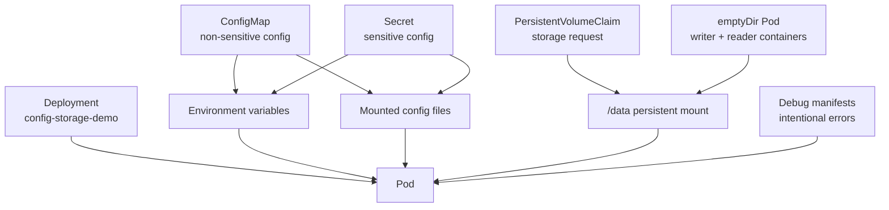

# Day 7 - ConfigMaps, Secrets, Storage, And Debugging

## Goal

Day 7 explains how applications receive configuration, sensitive values, and storage in Kubernetes, then goes deep into the common error states students will see in real projects.

By the end of this module, students should be able to:

- Create and use ConfigMaps.
- Create and use Secrets.
- Inject ConfigMap and Secret values as environment variables.
- Mount ConfigMaps and Secrets as files.
- Understand basic Kubernetes storage types.
- Create a PersistentVolumeClaim.
- Mount PVC storage into a Pod.
- Use `emptyDir` for temporary shared Pod storage.
- Debug common Kubernetes errors using `get`, `describe`, `logs`, `events`, `exec`, and YAML inspection.
- Understand error states such as `ImagePullBackOff`, `CrashLoopBackOff`, `CreateContainerConfigError`, `Pending`, `ContainerCreating`, `OOMKilled`, readiness failures, and Service endpoint issues.

## Day 7 File Structure

```text
day7/
|-- README.md
|-- manifests/
|   |-- 00-namespace.yaml
|   |-- 01-configmap.yaml
|   |-- 02-secret.yaml
|   |-- 03-pvc.yaml
|   |-- 04-config-secret-storage-deployment.yaml
|   |-- 05-emptydir-pod.yaml
|-- debug/
|   |-- 01-imagepullbackoff.yaml
|   |-- 02-crashloopbackoff.yaml
|   |-- 03-createcontainerconfigerror.yaml
|   |-- 04-pending-missing-pvc.yaml
|   |-- 05-readiness-failure.yaml
|   |-- 06-oomkilled.yaml
```

## Architecture Diagram



## 1. ConfigMaps

A ConfigMap stores non-sensitive configuration data.

Use ConfigMaps for:

- application mode
- log level
- feature flags
- non-secret URLs
- config files
- environment-specific values

Example:

```yaml
apiVersion: v1
kind: ConfigMap
metadata:
  name: app-config
data:
  APP_MODE: "dev"
  LOG_LEVEL: "info"
```

Simple explanation:

```text
ConfigMap keeps configuration outside the container image.
```

Why this matters:

```text
Same image can run in dev, qa, and prod with different configuration.
```

## Ways To Use ConfigMaps

ConfigMaps can be used as:

```text
1. Environment variables
2. Command arguments
3. Mounted files inside a volume
```

Day 7 uses ConfigMap as both environment variables and mounted files.

Environment variable example:

```yaml
- name: APP_MODE
  valueFrom:
    configMapKeyRef:
      name: app-config
      key: APP_MODE
```

Mounted file example:

```yaml
volumes:
  - name: config-volume
    configMap:
      name: app-config
```

## 2. Secrets

A Secret stores sensitive information.

Use Secrets for:

- passwords
- API tokens
- database usernames
- private keys
- TLS certificates
- image pull credentials

Example:

```yaml
apiVersion: v1
kind: Secret
metadata:
  name: app-secret
type: Opaque
stringData:
  DB_USERNAME: app_user
  DB_PASSWORD: change-me-in-real-projects
```

Simple explanation:

```text
Secret is used for sensitive values that should not be hardcoded in a Deployment YAML.
```

Important security note:

```text
Kubernetes Secrets are encoded, not automatically strongly encrypted in every cluster setup.
In production, enable encryption at rest and restrict RBAC access to Secrets.
```

## Ways To Use Secrets

Secrets can be used as:

```text
1. Environment variables
2. Mounted files
3. Image pull secrets
4. TLS secrets
```

Environment variable example:

```yaml
- name: DB_PASSWORD
  valueFrom:
    secretKeyRef:
      name: app-secret
      key: DB_PASSWORD
```

Mounted Secret example:

```yaml
volumes:
  - name: secret-volume
    secret:
      secretName: app-secret
```

## ConfigMap Vs Secret

| ConfigMap | Secret |
| --- | --- |
| Stores non-sensitive config | Stores sensitive config |
| Example: log level | Example: password |
| Can be mounted as file | Can be mounted as file |
| Can be injected as env | Can be injected as env |
| Not for confidential data | Use with RBAC and encryption controls |

## 3. Storage In Kubernetes

Containers are temporary.

If a container restarts, data written inside the container filesystem can be lost.

Kubernetes provides volumes to manage data.

Common volume types:

| Volume Type | Meaning |
| --- | --- |
| emptyDir | Temporary storage for one Pod lifecycle |
| configMap | Mount ConfigMap as files |
| secret | Mount Secret as files |
| persistentVolumeClaim | Request persistent storage |
| hostPath | Mount node filesystem path; mostly for local/special cases |
| CSI volumes | Storage from cloud or storage providers |

## emptyDir

`emptyDir` is created when a Pod starts and deleted when the Pod is removed.

Use case:

```text
Two containers in the same Pod share temporary files.
```

Day 7 file:

```text
day7/manifests/05-emptydir-pod.yaml
```

Important:

```text
emptyDir is not permanent storage.
If the Pod is deleted, the data is deleted.
```

## PersistentVolume And PersistentVolumeClaim

A PersistentVolume is actual storage in the cluster.

A PersistentVolumeClaim is a request for storage.

Simple flow:

```text
Pod ---> PVC ---> PV ---> actual storage
```

In Minikube, the default storage class can dynamically create storage for a PVC.

Check storage class:

```powershell
kubectl get storageclass
```

Check PVC:

```powershell
kubectl get pvc -n day7
```

## 4. Practical - ConfigMap, Secret, PVC, And Deployment

Apply namespace:

```powershell
kubectl apply -f day7/manifests/00-namespace.yaml
```

Apply ConfigMap and Secret:

```powershell
kubectl apply -f day7/manifests/01-configmap.yaml
kubectl apply -f day7/manifests/02-secret.yaml
```

Apply PVC:

```powershell
kubectl apply -f day7/manifests/03-pvc.yaml
```

Check:

```powershell
kubectl get configmap -n day7
kubectl get secret -n day7
kubectl get pvc -n day7
```

Apply Deployment:

```powershell
kubectl apply -f day7/manifests/04-config-secret-storage-deployment.yaml
```

Wait:

```powershell
kubectl rollout status deployment/config-storage-demo -n day7
kubectl get pods -n day7
```

Inspect data written to persistent volume:

```powershell
kubectl exec -n day7 deployment/config-storage-demo -- cat /data/status.txt
```

Inspect mounted ConfigMap file:

```powershell
kubectl exec -n day7 deployment/config-storage-demo -- cat /etc/app-config/app.properties
```

Inspect mounted Secret files:

```powershell
kubectl exec -n day7 deployment/config-storage-demo -- ls /etc/app-secret
```

Do not print real production secrets in class or logs. This is only a local training demo.

## 5. Practical - emptyDir

Apply emptyDir demo:

```powershell
kubectl apply -f day7/manifests/05-emptydir-pod.yaml
```

Check Pod:

```powershell
kubectl get pod emptydir-demo -n day7
```

Check writer logs:

```powershell
kubectl logs emptydir-demo -n day7 -c writer
```

Check reader logs:

```powershell
kubectl logs emptydir-demo -n day7 -c reader
```

Exec into reader container:

```powershell
kubectl exec -it emptydir-demo -n day7 -c reader -- sh
cat /cache/time.log
```

Meaning:

```text
Both containers share the same emptyDir volume at /cache.
```

## 6. Debugging Mindset

When something fails in Kubernetes, debug in this order:

```text
1. What object is failing?
2. What is the current status?
3. What do Events say?
4. What do container logs say?
5. Is the YAML correct?
6. Are dependencies available? ConfigMap, Secret, PVC, Service, image, DNS.
7. Is the issue app-level, Kubernetes-level, or infrastructure-level?
```

Core commands:

```powershell
kubectl get pods -n <namespace>
kubectl describe pod <pod-name> -n <namespace>
kubectl logs <pod-name> -n <namespace>
kubectl logs <pod-name> -n <namespace> --previous
kubectl get events -n <namespace> --sort-by=.metadata.creationTimestamp
kubectl get deployment,rs,pods -n <namespace>
kubectl get svc,endpoints,endpointslice -n <namespace>
kubectl exec -it <pod-name> -n <namespace> -- sh
kubectl describe node <node-name>
```

## 7. Common Kubernetes Errors And How To Debug

## ImagePullBackOff / ErrImagePull

Meaning:

```text
Kubernetes cannot pull the container image.
```

Common causes:

- Wrong image name.
- Wrong image tag.
- Private registry requires imagePullSecret.
- Registry is down.
- Node has no internet access.

Demo manifest:

```powershell
kubectl apply -f day7/debug/01-imagepullbackoff.yaml
```

Debug commands:

```powershell
kubectl get pod imagepull-error-demo -n day7
kubectl describe pod imagepull-error-demo -n day7
kubectl get events -n day7 --sort-by=.metadata.creationTimestamp
```

What to check in `describe`:

```text
Failed to pull image
manifest unknown
pull access denied
Back-off pulling image
```

Fix:

```text
Use the correct image and tag.
For private images, create and reference imagePullSecret.
```

## CrashLoopBackOff

Meaning:

```text
The container starts, crashes, restarts, and keeps repeating.
```

Common causes:

- Application exits immediately.
- Missing environment variable.
- Bad application config.
- App cannot connect to dependency.
- Command or args are wrong.

Demo manifest:

```powershell
kubectl apply -f day7/debug/02-crashloopbackoff.yaml
```

Debug commands:

```powershell
kubectl get pod crashloop-demo -n day7
kubectl describe pod crashloop-demo -n day7
kubectl logs crashloop-demo -n day7
kubectl logs crashloop-demo -n day7 --previous
```

Important:

```text
Use --previous when the current container restarted and you need logs from the last failed run.
```

Fix:

```text
Fix the app command, config, environment variables, or dependency issue.
```

## CreateContainerConfigError

Meaning:

```text
Kubernetes cannot create the container because required configuration is missing or invalid.
```

Common causes:

- Missing ConfigMap.
- Missing Secret.
- Wrong key inside ConfigMap or Secret.
- Invalid volume reference.

Demo manifest:

```powershell
kubectl apply -f day7/debug/03-createcontainerconfigerror.yaml
```

Debug commands:

```powershell
kubectl get pod missing-secret-demo -n day7
kubectl describe pod missing-secret-demo -n day7
kubectl get secret -n day7
```

What to look for:

```text
secret "missing-secret" not found
couldn't find key
```

Fix:

```text
Create the missing Secret or correct the Secret name/key in the YAML.
```

## Pending Pod

Meaning:

```text
Pod is accepted by the API server but cannot be scheduled or fully started.
```

Common causes:

- Not enough CPU or memory on nodes.
- PVC is missing or unbound.
- Node selector does not match any node.
- Taints require tolerations.
- Storage class is missing.

Demo manifest:

```powershell
kubectl apply -f day7/debug/04-pending-missing-pvc.yaml
```

Debug commands:

```powershell
kubectl get pod missing-pvc-demo -n day7
kubectl describe pod missing-pvc-demo -n day7
kubectl get pvc -n day7
kubectl get events -n day7 --sort-by=.metadata.creationTimestamp
```

What to look for:

```text
persistentvolumeclaim "missing-pvc" not found
pod has unbound immediate PersistentVolumeClaims
0/1 nodes are available
```

Fix:

```text
Create the PVC, fix claimName, or fix storage class / node scheduling rules.
```

## ContainerCreating Stuck

Meaning:

```text
Kubernetes scheduled the Pod but container setup is not complete.
```

Common causes:

- Image pull is slow.
- Volume mount problem.
- CNI networking problem.
- Secret or ConfigMap mount issue.
- Container runtime issue.

Debug commands:

```powershell
kubectl describe pod <pod-name> -n day7
kubectl get events -n day7 --sort-by=.metadata.creationTimestamp
kubectl describe node <node-name>
```

Fix depends on the event message.

## OOMKilled

Meaning:

```text
The container used more memory than its limit and was killed.
```

Demo manifest:

```powershell
kubectl apply -f day7/debug/06-oomkilled.yaml
```

Debug commands:

```powershell
kubectl get pod oomkilled-demo -n day7
kubectl describe pod oomkilled-demo -n day7
kubectl logs oomkilled-demo -n day7 --previous
```

What to check:

```text
Last State: Terminated
Reason: OOMKilled
Exit Code: 137
```

Fix:

```text
Increase memory limit, reduce app memory usage, fix memory leak, or tune requests/limits.
```

## Readiness Probe Failure

Meaning:

```text
Container is running but not ready to receive traffic.
```

Demo manifest:

```powershell
kubectl apply -f day7/debug/05-readiness-failure.yaml
```

Debug commands:

```powershell
kubectl get deployment readiness-failure-demo -n day7
kubectl get pods -n day7
kubectl describe pod <readiness-pod-name> -n day7
kubectl get endpoints -n day7
```

What happens:

```text
Pod may show Running but READY 0/1.
Service endpoints will not include this Pod.
```

Fix:

```text
Correct the readiness path, port, initial delay, or application health endpoint.
```

## Service Has No Endpoints

Meaning:

```text
Service exists, but no ready Pods match its selector.
```

Common causes:

- Selector does not match Pod labels.
- Pods are not Ready.
- Pods are in a different namespace.
- Readiness probe is failing.

Debug commands:

```powershell
kubectl describe svc <service-name> -n day7
kubectl get pods -n day7 --show-labels
kubectl get endpoints <service-name> -n day7
kubectl get endpointslice -n day7
```

Fix:

```text
Make Service selector match Pod labels and ensure Pods are Ready.
```

## Forbidden / RBAC Error

Meaning:

```text
The user or ServiceAccount does not have permission to perform the action.
```

Example error:

```text
Error from server (Forbidden): pods is forbidden
```

Debug commands:

```powershell
kubectl auth can-i get pods -n day7
kubectl auth can-i delete pods -n day7
kubectl auth can-i list secrets -n day7
```

Fix:

```text
Create or update Role, ClusterRole, RoleBinding, or ClusterRoleBinding carefully.
```

## Invalid YAML / Validation Error

Meaning:

```text
The manifest is not valid YAML or does not match Kubernetes API schema.
```

Common causes:

- Wrong indentation.
- Wrong apiVersion.
- Wrong field name.
- String used where number is expected.
- Duplicate keys.

Debug commands:

```powershell
kubectl apply --dry-run=client -f <file>.yaml
kubectl explain deployment.spec.template.spec.containers
kubectl explain pod.spec.volumes
```

Fix:

```text
Correct YAML indentation and fields using kubectl explain or official docs.
```

## 8. Debugging Practical Flow

Run working app first:

```powershell
kubectl apply -f day7/manifests/00-namespace.yaml
kubectl apply -f day7/manifests/01-configmap.yaml
kubectl apply -f day7/manifests/02-secret.yaml
kubectl apply -f day7/manifests/03-pvc.yaml
kubectl apply -f day7/manifests/04-config-secret-storage-deployment.yaml
kubectl apply -f day7/manifests/05-emptydir-pod.yaml
```

Verify:

```powershell
kubectl get all -n day7
kubectl get configmap,secret,pvc -n day7
kubectl exec -n day7 deployment/config-storage-demo -- cat /data/status.txt
```

Then apply one broken manifest at a time:

```powershell
kubectl apply -f day7/debug/01-imagepullbackoff.yaml
kubectl get pods -n day7
kubectl describe pod imagepull-error-demo -n day7
```

Clean the broken demo before moving to the next:

```powershell
kubectl delete -f day7/debug/01-imagepullbackoff.yaml
```

Repeat with the other debug manifests.

## Complete Day 7 Command Flow

```powershell
minikube start --driver=docker
kubectl apply -f day7/manifests/00-namespace.yaml
kubectl apply -f day7/manifests/01-configmap.yaml
kubectl apply -f day7/manifests/02-secret.yaml
kubectl apply -f day7/manifests/03-pvc.yaml
kubectl apply -f day7/manifests/04-config-secret-storage-deployment.yaml
kubectl apply -f day7/manifests/05-emptydir-pod.yaml

kubectl get all -n day7
kubectl get configmap,secret,pvc -n day7
kubectl rollout status deployment/config-storage-demo -n day7
kubectl exec -n day7 deployment/config-storage-demo -- cat /data/status.txt
kubectl logs emptydir-demo -n day7 -c reader

kubectl apply -f day7/debug/01-imagepullbackoff.yaml
kubectl describe pod imagepull-error-demo -n day7
kubectl delete -f day7/debug/01-imagepullbackoff.yaml

kubectl apply -f day7/debug/02-crashloopbackoff.yaml
kubectl logs crashloop-demo -n day7 --previous
kubectl delete -f day7/debug/02-crashloopbackoff.yaml

kubectl apply -f day7/debug/03-createcontainerconfigerror.yaml
kubectl describe pod missing-secret-demo -n day7
kubectl delete -f day7/debug/03-createcontainerconfigerror.yaml

kubectl apply -f day7/debug/04-pending-missing-pvc.yaml
kubectl describe pod missing-pvc-demo -n day7
kubectl delete -f day7/debug/04-pending-missing-pvc.yaml

kubectl apply -f day7/debug/05-readiness-failure.yaml
kubectl describe pod <readiness-pod-name> -n day7
kubectl delete -f day7/debug/05-readiness-failure.yaml

kubectl apply -f day7/debug/06-oomkilled.yaml
kubectl describe pod oomkilled-demo -n day7
kubectl logs oomkilled-demo -n day7 --previous
kubectl delete -f day7/debug/06-oomkilled.yaml
```

## Cleanup

```powershell
kubectl delete namespace day7 --ignore-not-found=true
minikube stop
```

## Interview Questions

### What is a ConfigMap?

A ConfigMap stores non-sensitive configuration data separately from the container image.

### What is a Secret?

A Secret stores sensitive data such as passwords, tokens, and credentials.

### ConfigMap vs Secret?

ConfigMap is for non-sensitive configuration. Secret is for sensitive configuration and should be protected with RBAC and encryption at rest in production.

### What is a PVC?

A PersistentVolumeClaim is a request for storage that a Pod can mount.

### What is emptyDir?

`emptyDir` is temporary storage shared by containers in the same Pod. It is deleted when the Pod is deleted.

### What is ImagePullBackOff?

Kubernetes cannot pull the container image and is backing off before retrying.

### What is CrashLoopBackOff?

The container repeatedly starts, crashes, and restarts.

### What is CreateContainerConfigError?

Kubernetes cannot create the container because required configuration, such as a ConfigMap or Secret, is missing or invalid.

### What is OOMKilled?

The container exceeded its memory limit and was killed by the system.

### Which commands are most important for debugging?

`kubectl get`, `kubectl describe`, `kubectl logs`, `kubectl logs --previous`, `kubectl get events`, and `kubectl exec`.

## Official References

- ConfigMaps: https://kubernetes.io/docs/concepts/configuration/configmap/
- Secrets: https://kubernetes.io/docs/concepts/configuration/secret/
- Persistent Volumes: https://kubernetes.io/docs/concepts/storage/persistent-volumes/
- Volumes: https://kubernetes.io/docs/concepts/storage/volumes/
- Debug Pods: https://kubernetes.io/docs/tasks/debug/debug-application/debug-pods/
- Debug Services: https://kubernetes.io/docs/tasks/debug/debug-application/debug-service/
- Determine Pod Failure Reason: https://kubernetes.io/docs/tasks/debug/debug-application/determine-reason-pod-failure/
