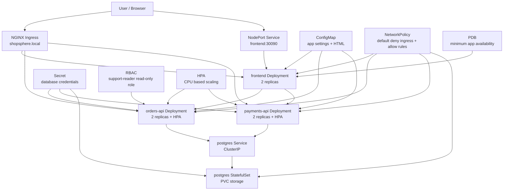

# Final Project - ShopSphere Production-Like Kubernetes Platform

## Goal

ShopSphere is the end-to-end capstone project for Kubernetes Zero To Hero.

This project combines the main topics from Day 1 to Day 7 into one production-like deployment:

- Namespace
- YAML manifests
- Labels and selectors
- Deployments and ReplicaSets
- StatefulSet
- Services
- NodePort
- Ingress
- ConfigMap
- Secret
- Persistent storage
- Liveness and readiness probes
- Init containers
- Resource requests and limits
- ResourceQuota and LimitRange
- Horizontal Pod Autoscaler
- PodDisruptionBudget
- RBAC
- NetworkPolicy
- Debugging and troubleshooting
- Helm packaging

The project is intentionally simple enough for Minikube, but it is structured like a real platform team would structure a Kubernetes application.

## Project Story

ShopSphere is a small ecommerce platform.

It has:

- `frontend`: storefront UI served through NodePort and Ingress.
- `orders-api`: internal API for orders.
- `payments-api`: internal API for payments.
- `postgres`: database running as a StatefulSet with persistent storage.
- `debug-toolbox`: temporary troubleshooting Pod for DNS, Service, and NetworkPolicy checks.

## Architecture Diagram



## Folder Structure

```text
final-project/
|-- README.md
|-- manifests/
|   |-- 00-namespace.yaml
|   |-- 01-resource-quota-limitrange.yaml
|   |-- 02-serviceaccounts-rbac.yaml
|   |-- 03-configmap.yaml
|   |-- 04-secret.yaml
|   |-- 05-postgres-services.yaml
|   |-- 06-postgres-statefulset.yaml
|   |-- 07-orders-deployment.yaml
|   |-- 08-orders-service.yaml
|   |-- 09-payments-deployment.yaml
|   |-- 10-payments-service.yaml
|   |-- 11-frontend-deployment.yaml
|   |-- 12-frontend-service.yaml
|   |-- 13-ingress.yaml
|   |-- 14-networkpolicy.yaml
|   |-- 15-hpa.yaml
|   |-- 16-pdb.yaml
|-- debug/
|   |-- 01-debug-toolbox.yaml
|   |-- 02-bad-service-selector.yaml
|   |-- 03-bad-secret-reference.yaml
|   |-- 04-bad-readiness-path.yaml
|-- helm/
|   |-- shopsphere/
|       |-- Chart.yaml
|       |-- values.yaml
|       |-- templates/
```

## Topic Coverage

| Topic | Where It Is Used |
| --- | --- |
| Namespace | `00-namespace.yaml` creates `shopsphere` |
| YAML | Every manifest is declarative YAML |
| Labels and selectors | Deployments, Services, NetworkPolicies, PDBs |
| Pod | Created by Deployments, StatefulSet, debug toolbox |
| Deployment | `frontend`, `orders-api`, `payments-api` |
| ReplicaSet | Automatically managed by each Deployment |
| StatefulSet | `postgres` with stable identity and storage |
| Service | frontend, orders, payments, postgres |
| NodePort | frontend exposed on `30090` |
| Ingress | `shopsphere.local` routes `/`, `/orders`, `/payments` |
| ConfigMap | app environment, service URLs, frontend HTML |
| Secret | PostgreSQL username, password, database name |
| PVC | PostgreSQL persistent data volume |
| Probes | liveness and readiness checks for apps and database |
| Init container | orders/payments wait for PostgreSQL before starting |
| HPA | orders/payments CPU autoscaling |
| RBAC | support-reader ServiceAccount gets read-only access |
| NetworkPolicy | default deny ingress and allow required traffic |
| PDB | protects app availability during voluntary disruption |
| Helm | reusable production-style chart under `helm/shopsphere` |
| Debugging | debug toolbox and intentionally broken manifests |

## Why This Looks Production-Like

Production Kubernetes is not only `kubectl apply deployment.yaml`.

A production-style application usually includes:

- separated namespaces
- standard labels
- least-privilege RBAC
- configuration outside container images
- sensitive values stored as Secrets
- health checks
- resource requests and limits
- controlled scaling
- disruption protection
- persistent storage for stateful components
- network isolation
- repeatable packaging with Helm
- clear troubleshooting commands

ShopSphere includes all of these in a Minikube-friendly form.

## Prerequisites

Use Docker Desktop and Minikube.

For the NetworkPolicy practical, start Minikube with Calico:

```powershell
minikube delete
minikube start --driver=docker --cni=calico
```

Enable Ingress:

```powershell
minikube addons enable ingress
```

Enable Metrics Server for HPA:

```powershell
minikube addons enable metrics-server
```

Check the cluster:

```powershell
kubectl cluster-info
kubectl get nodes
kubectl get pods -n kube-system
```

## Deploy With Raw Manifests

Apply the full platform:

```powershell
kubectl apply -f final-project/manifests
```

Wait for rollouts:

```powershell
kubectl rollout status deployment/frontend -n shopsphere --timeout=180s
kubectl rollout status deployment/orders-api -n shopsphere --timeout=180s
kubectl rollout status deployment/payments-api -n shopsphere --timeout=180s
kubectl rollout status statefulset/postgres -n shopsphere --timeout=180s
```

Check everything:

```powershell
kubectl get all -n shopsphere
kubectl get pvc -n shopsphere
kubectl get ingress -n shopsphere
kubectl get networkpolicy -n shopsphere
kubectl get hpa -n shopsphere
kubectl get pdb -n shopsphere
```

Expected result:

```text
frontend Pods: Running and Ready
orders-api Pods: Running and Ready
payments-api Pods: Running and Ready
postgres Pod: Running and Ready
postgres PVC: Bound
HPA objects: created
PDB objects: created
NetworkPolicies: created
```

## Access The Application With NodePort

Get the frontend URL:

```powershell
minikube service frontend -n shopsphere --url
```

Open the returned URL in the browser.

You can also test through the Minikube node:

```powershell
minikube ssh -- curl -s http://127.0.0.1:30090
```

## Access The Application With Ingress

Get the Minikube IP:

```powershell
minikube ip
```

Use `curl.exe --resolve` so you do not need to edit the Windows hosts file:

```powershell
curl.exe --resolve shopsphere.local:80:<minikube-ip> http://shopsphere.local/
curl.exe --resolve shopsphere.local:80:<minikube-ip> http://shopsphere.local/orders
curl.exe --resolve shopsphere.local:80:<minikube-ip> http://shopsphere.local/payments
```

Replace `<minikube-ip>` with the real IP from `minikube ip`.

Expected output:

```text
/          -> ShopSphere storefront HTML
/orders    -> orders API JSON-like response
/payments  -> payments API JSON-like response
```

## Verify Services And DNS

Create the debug toolbox:

```powershell
kubectl apply -f final-project/debug/01-debug-toolbox.yaml
kubectl wait --for=condition=Ready pod/debug-toolbox -n shopsphere --timeout=120s
```

Test DNS:

```powershell
kubectl exec -n shopsphere debug-toolbox -- nslookup orders-api.shopsphere.svc.cluster.local
kubectl exec -n shopsphere debug-toolbox -- nslookup payments-api.shopsphere.svc.cluster.local
kubectl exec -n shopsphere debug-toolbox -- nslookup postgres.shopsphere.svc.cluster.local
```

Test internal HTTP:

```powershell
kubectl exec -n shopsphere debug-toolbox -- wget -qO- http://orders-api:8080/orders
kubectl exec -n shopsphere debug-toolbox -- wget -qO- http://payments-api:8080/payments
```

Test database port reachability:

```powershell
kubectl exec -n shopsphere debug-toolbox -- nc -zv postgres 5432
```

## Verify ConfigMap And Secret Usage

Check ConfigMap values:

```powershell
kubectl get configmap shopsphere-config -n shopsphere -o yaml
```

Check Secret keys without exposing decoded values:

```powershell
kubectl get secret shopsphere-db-secret -n shopsphere
kubectl describe secret shopsphere-db-secret -n shopsphere
```

Check environment injection inside an API Pod:

```powershell
$pod = kubectl get pod -n shopsphere -l app.kubernetes.io/name=orders-api -o jsonpath="{.items[0].metadata.name}"
kubectl exec -n shopsphere $pod -- printenv APP_ENV
kubectl exec -n shopsphere $pod -- printenv POSTGRES_HOST
```

## Verify Storage

Check PVC:

```powershell
kubectl get pvc -n shopsphere
kubectl describe pvc postgres-data-postgres-0 -n shopsphere
```

Check PostgreSQL Pod:

```powershell
kubectl get pod postgres-0 -n shopsphere
kubectl describe pod postgres-0 -n shopsphere
kubectl logs postgres-0 -n shopsphere
```

Why StatefulSet is used here:

```text
PostgreSQL needs stable identity and stable storage.
Deployment is good for stateless apps.
StatefulSet is better for stateful apps.
```

## Verify HPA

Check HPA objects:

```powershell
kubectl get hpa -n shopsphere
kubectl describe hpa orders-api-hpa -n shopsphere
kubectl describe hpa payments-api-hpa -n shopsphere
```

Important note:

```text
HPA needs Metrics Server.
If Metrics Server is not ready, HPA objects are created but CPU metrics may show as unknown.
```

## Verify RBAC

The `support-reader` ServiceAccount should be able to read resources but not delete them.

```powershell
kubectl auth can-i get pods -n shopsphere --as=system:serviceaccount:shopsphere:support-reader
kubectl auth can-i list services -n shopsphere --as=system:serviceaccount:shopsphere:support-reader
kubectl auth can-i delete pods -n shopsphere --as=system:serviceaccount:shopsphere:support-reader
kubectl auth can-i list secrets -n shopsphere --as=system:serviceaccount:shopsphere:support-reader
```

Expected:

```text
get pods: yes
list services: yes
delete pods: no
list secrets: no
```

## Verify NetworkPolicy

Check policies:

```powershell
kubectl get networkpolicy -n shopsphere
kubectl describe networkpolicy default-deny-ingress -n shopsphere
kubectl describe networkpolicy allow-api-ingress -n shopsphere
kubectl describe networkpolicy allow-postgres-from-apis -n shopsphere
```

Meaning:

```text
default-deny-ingress blocks unexpected incoming traffic.
allow-frontend-ingress permits users to reach frontend.
allow-api-ingress permits frontend, debug toolbox, and ingress controller to reach APIs.
allow-postgres-from-apis permits only API/debug Pods to reach PostgreSQL.
```

## Verify Rollout And Self-Healing

Check ReplicaSets:

```powershell
kubectl get rs -n shopsphere
```

Delete one orders Pod:

```powershell
kubectl delete pod -n shopsphere -l app.kubernetes.io/name=orders-api
```

Watch Kubernetes recreate it:

```powershell
kubectl get pods -n shopsphere -w
```

This proves Deployment -> ReplicaSet -> Pod self-healing.

## Run The Debugging Labs

### 1. Service Has No Endpoints

Apply broken Service selector:

```powershell
kubectl apply -f final-project/debug/02-bad-service-selector.yaml
kubectl get endpoints broken-orders-service -n shopsphere
kubectl describe svc broken-orders-service -n shopsphere
kubectl get pods -n shopsphere --show-labels
```

Expected issue:

```text
Service exists but endpoints are empty because selector does not match Pod labels.
```

Cleanup:

```powershell
kubectl delete -f final-project/debug/02-bad-service-selector.yaml
```

### 2. Missing Secret Error

Apply broken Secret reference:

```powershell
kubectl apply -f final-project/debug/03-bad-secret-reference.yaml
kubectl get pod missing-secret-api -n shopsphere
kubectl describe pod missing-secret-api -n shopsphere
```

Expected issue:

```text
CreateContainerConfigError because referenced Secret does not exist.
```

Cleanup:

```powershell
kubectl delete -f final-project/debug/03-bad-secret-reference.yaml
```

### 3. Readiness Probe Failure

Apply bad readiness Deployment:

```powershell
kubectl apply -f final-project/debug/04-bad-readiness-path.yaml
kubectl get deployment bad-readiness-api -n shopsphere
kubectl get pods -n shopsphere -l app.kubernetes.io/name=bad-readiness-api
kubectl describe pod -n shopsphere -l app.kubernetes.io/name=bad-readiness-api
```

Expected issue:

```text
Pod runs but stays 0/1 Ready because readiness probe path returns 404.
```

Cleanup:

```powershell
kubectl delete -f final-project/debug/04-bad-readiness-path.yaml
```

## Deploy With Helm

The Helm chart deploys the same project in a release-friendly format.

Render the chart first:

```powershell
helm template shopsphere final-project/helm/shopsphere
```

Install:

```powershell
helm install shopsphere final-project/helm/shopsphere
```

Check release:

```powershell
helm list -n shopsphere
kubectl get all -n shopsphere
```

Upgrade example:

```powershell
helm upgrade shopsphere final-project/helm/shopsphere --set replicaCount.orders=3
kubectl get deployment orders-api -n shopsphere
helm history shopsphere -n shopsphere
```

Rollback example:

```powershell
helm rollback shopsphere 1 -n shopsphere
helm history shopsphere -n shopsphere
```

Uninstall:

```powershell
helm uninstall shopsphere -n shopsphere
kubectl delete namespace shopsphere --ignore-not-found=true
```

## Production Readiness Discussion

This project is production-like for learning, but real production would add more:

- real application container images from CI/CD
- private image registry
- TLS certificates for Ingress
- External Secrets or cloud secret manager
- managed database or database operator
- centralized logs
- metrics dashboards
- tracing
- backup and restore process
- stricter egress NetworkPolicies
- admission policies
- image scanning
- separate dev, qa, staging, and prod values files

## Common Troubleshooting Commands

Use this order in real projects:

```powershell
kubectl get all -n shopsphere
kubectl get pods -n shopsphere -o wide
kubectl describe pod <pod-name> -n shopsphere
kubectl logs <pod-name> -n shopsphere
kubectl logs <pod-name> -n shopsphere --previous
kubectl get events -n shopsphere --sort-by=.metadata.creationTimestamp
kubectl get svc,endpoints,endpointslice -n shopsphere
kubectl get ingress -n shopsphere
kubectl get networkpolicy -n shopsphere
kubectl get pvc -n shopsphere
kubectl describe hpa <hpa-name> -n shopsphere
```

## Cleanup

Delete raw manifest deployment:

```powershell
kubectl delete -f final-project/debug --ignore-not-found=true
kubectl delete -f final-project/manifests --ignore-not-found=true
kubectl delete namespace shopsphere --ignore-not-found=true
```

Stop Minikube:

```powershell
minikube stop
```

## Interview Questions

### Why do we use a Namespace?

To isolate resources for this project and make cleanup, RBAC, quota, and policy management easier.

### Why do we use Deployments for frontend and APIs?

They are stateless services. Deployments provide replicas, rolling updates, rollback, and self-healing.

### Why do we use StatefulSet for PostgreSQL?

PostgreSQL needs stable identity and persistent storage. StatefulSet is designed for stateful workloads.

### Why do we need Services?

Pod IPs change when Pods restart. Services provide stable DNS names and stable virtual IPs.

### Why do we need Ingress?

Ingress provides HTTP routing from outside the cluster to internal Services.

### Why do we use ConfigMap?

ConfigMap keeps non-sensitive configuration outside the container image.

### Why do we use Secret?

Secret stores sensitive configuration such as database credentials. In production, combine it with RBAC, encryption at rest, and external secret management.

### Why do we use probes?

Readiness probes decide if a Pod should receive traffic. Liveness probes decide if a stuck container should be restarted.

### Why do we use HPA?

HPA automatically adjusts the number of Pods based on metrics such as CPU utilization.

### Why do we use NetworkPolicy?

NetworkPolicy controls which Pods can communicate. It reduces blast radius if one component is compromised.

### Why do we use PDB?

A PodDisruptionBudget protects minimum availability during voluntary disruptions such as node drain.

## Official References

- Ingress: https://kubernetes.io/docs/concepts/services-networking/ingress/
- NetworkPolicy: https://kubernetes.io/docs/concepts/services-networking/network-policies/
- Horizontal Pod Autoscaling: https://kubernetes.io/docs/concepts/workloads/autoscaling/horizontal-pod-autoscale/
- PodDisruptionBudget: https://kubernetes.io/docs/tasks/run-application/configure-pdb/
- ConfigMaps: https://kubernetes.io/docs/concepts/configuration/configmap/
- Secrets: https://kubernetes.io/docs/concepts/configuration/secret/
- Persistent Volumes: https://kubernetes.io/docs/concepts/storage/persistent-volumes/
- Debug Pods: https://kubernetes.io/docs/tasks/debug/debug-application/debug-pods/
